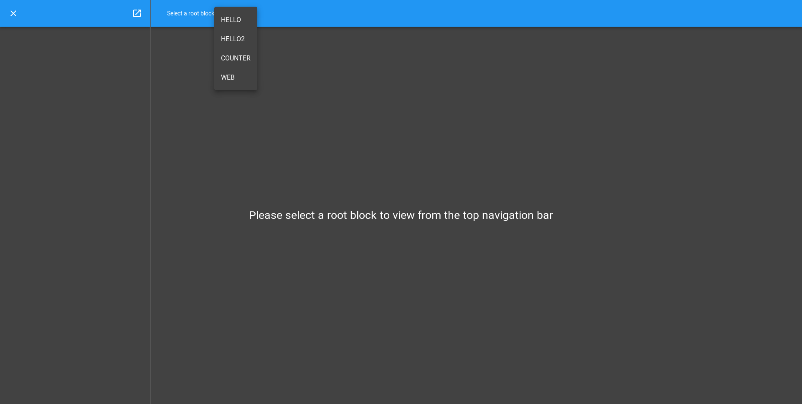
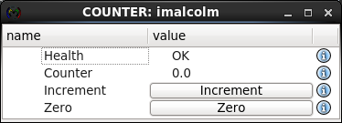
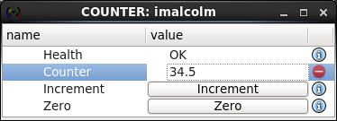

.. _counter_tutorial:

Counter Tutorial
================

.. module:: malcolm.core

You should already know how to run up a Malcolm `process_` with some `Blocks
<block_>` that are each composed of `controller_` with `Parts <part_>`, and have
seen a Part that exposes a `method_`. Now we will look at a Part that exposes an
`attribute_` as well.

Let's take the example of a Counter. It contains:

- a writeable `attribute_` called ``counter`` which will keep the current
  counter value.
- a writeable `attribute_` called ``delta`` which will keep the amount to
  increment the counter value by.
- a `method_` zero() which will set ``counter = 0``.
- a `method_` increment() which will set ``counter = counter + delta``.

The block definition in ``./malcolm/modules/demo/blocks/counter_block.yaml``
looks very similar to the hello_block example in the previous tutorial:

.. literalinclude:: ../../malcolm/modules/demo/blocks/counter_block.yaml
    :language: yaml

It creates the Methods and Attributes you would expect:

.. digraph:: counter_controllers_and_parts

    newrank=true;  // Sensible ranking of clusters
    bgcolor=transparent
    node [fontname=Arial fontsize=10 shape=rect style=filled fillcolor="#8BC4E9"]
    graph [fontname=Arial fontsize=11]
    edge [fontname=Arial fontsize=10 arrowhead=none]

    subgraph cluster_control {
        controller [label=<BasicController mri: 'COUNTER'>]
        cpart [label=<CounterPart name: 'counter'>]
        controller -> cpart
        label="Control"
    }

    subgraph cluster_view {
        block [label=<Block mri: 'COUNTER'>]
        zero [label=<Method name: 'zero'>]
        increment [label=<Method name: 'increment'>]
        delta [label=<Attribute name: 'delta'>]
        counter [label=<Attribute name: 'counter'>]
        health [label=<Attribute name: 'health'>]
        block -> zero
        block -> increment
        block -> counter
        block -> delta
        block -> health
        label="View"
    }

    {rank=same;controller block}
    {rank=same;cpart health zero increment counter delta}

    controller -> health [style=dashed]
    cpart -> zero [style=dashed]
    cpart -> increment [style=dashed]
    cpart -> counter [style=dashed]
    cpart -> delta [style=dashed]
    controller -> block [arrowhead=vee dir=from style=dashed label=produces]

Creating Attributes in a Part
-----------------------------

Let's take a look at the definition of `CounterPart` in
``./malcolm/modules/demo/parts/counterpart.py`` now:

.. literalinclude:: ../../malcolm/modules/demo/parts/counterpart.py
    :language: python

Again, we start by subclassing `Part`, but this time we define a couple of
`AttributeModel` instances. By convention, we declare class attributes with
the right names and value of None so that we don't have to override
``__init__``. It also makes the doc comments for these attributes (which
appear on the line before the definitions) more legible.

.. note:: We are using a type comment to declare the type of this attribute

    This is not strictly necessary at runtime, but it is good practice so that
    an IDE like PyCharm can tell what type the attribute is, and warn you if
    you try to use it in an unsupported way.

We move onto the ``setup`` method. First, we create two `AttributeModel`
instances. To make an AttributeModel we first need to make a meta object.
In our example we want a ``float64`` `NumberMeta` counter as we want to
demonstrate floating point numbers. If our counter was an integer we could
choose ``int32`` or ``int64``. The actual AttributeModel is returned by the
:meth:`~VMeta.create_attribute_model` method of this meta so that the correct
type of AttributeModel can be chosen by the particular type of Meta object we
specify. We specify a number of `tags_reference` on the Meta object that gives
some hints about how this Attribute will be used. In this case, we specify a
`config_tag` to say that this field is a configuration variable that will be
marked for load/save, and a `Widget` tag that tells a GUI which widget to use
to display this Attribute.

The rest of the ``setup`` function looks very similar to the one in the previous
tutorial, but this time we also register our `AttributeModel` so it appears in
the parent `block_`. We do this by calling
:meth:`~PartRegistrar.add_attribute_model` with 3 arguments:

- ``"counter"``: the name of the Attribute within the Block
- ``self.counter``: the AttributeModel instance
- ``self.counter.set_value``: the function that will be called when someone
  tries to "Put" to the Attribute. If one isn't supplied then the Attribute
  will not be writeable

We then do the same with ``delta`` to register a second Attribute.

.. note:: We are producing an `AttributeModel` rather than an `Attribute`.

    This is because the Attribute is a user facing View, with methods like
    :meth:`~Attribute.put_value`, while AttributeModel is a data centred model
    with methods like :meth:`~AttributeModel.set_value`. Each user gets their
    own `Attribute` view of a single underlying `AttributeModel` that holds the
    actual data.

In the two methods (zero and increment), we make use of the ``counter``
AttributeModel. We can get its value by using the ``value`` attribute and set
its value by calling the :meth:`~AttributeModel.set_value` method. This method
will validate the new value using the `VMeta` object we created in ``__init__``
and notify any interested subscribers that something has changed.

Visualising the Block with the GUI
----------------------------------

.. highlight:: ipython

There is a web GUI that ships with pymalcolm, called `malcolmjs`_. We can use it
to play with this counter block and see how it works. Let's launch our demo
again::

    [me@mypc pymalcolm]$ ./malcolm/imalcolm.py malcolm/modules/demo/DEMO-HELLO.yaml
    Loading...
    Python 2.7.13 (default, Oct  3 2017, 11:17:53)
    Type "copyright", "credits" or "license" for more information.

    IPython 5.4.1 -- An enhanced Interactive Python.
    ?         -> Introduction and overview of IPython's features.
    %quickref -> Quick reference.
    help      -> Python's own help system.
    object?   -> Details about 'object', use 'object??' for extra details.

    Welcome to iMalcolm.

    self.mri_list:
        ['HELLO', 'HELLO2', 'COUNTER', 'WEB']

    # To create a view of an existing Block
    block = self.block_view("<mri>")

    # To create a proxy of a Block in another Malcolm
    self.make_proxy("<client_comms_mri>", "<mri>")
    block = self.block_view("<mri>")

    # To view state of Blocks in a GUI
    !firefox localhost:8008

    In [1]:

Then open http://localhost:8008 in your favourite browser and click on the "..."
button next to "Select a root block" to select the **COUNTER** Block:

You will now see a representation of the **COUNTER** Block appear in the left
hand pane and the URL change to http://localhost:8008/gui/COUNTER:

If you try clicking the increment button a few times you should see the value
increase, the reset button should zero it and clicking on the counter value
should let you enter a number yourself. Clicking on the information icon next
to the counter value will give you a history of the values that the Attribute
has been set to.

Notice that the value we set counter to will also be validated by the meta
object we created, so you can enter ``34.5`` into the counter value, but if you
entered ``foo``, you will get a GUI that looks like this:

And a message on the console::

    malcolm.core.request: Exception raised for request Put(id=40, path=Array([u'COUNTER', u'counter']), value=u'foo', get=False)
    Traceback (most recent call last):
      File "./malcolm/../malcolm/core/controller.py", line 142, in _handle_request
        responses += handler(request)
      File "./malcolm/../malcolm/core/controller.py", line 192, in _handle_put
        value = attribute.meta.validate(request.value)
      File "./malcolm/../malcolm/core/models.py", line 641, in validate
        cast = self._np_type(value)
    ValueError: could not convert string to float: foo

Conclusion
----------

This second tutorial has taken us through creating Attributes in Blocks and
showed us a little bit of the error checking that `VMeta` instances
give us. Now we have a CounterPart, we could combine it with the HelloPart
from the previous tutorial, creating a Controller with 2 Parts that has
counter and ``greet()`` functionality. In the next tutorial we will see how
we can use this composition to control multiple child blocks with one parent
Block.

.. _malcolmjs: https://malcolmjs.readthedocs.io
