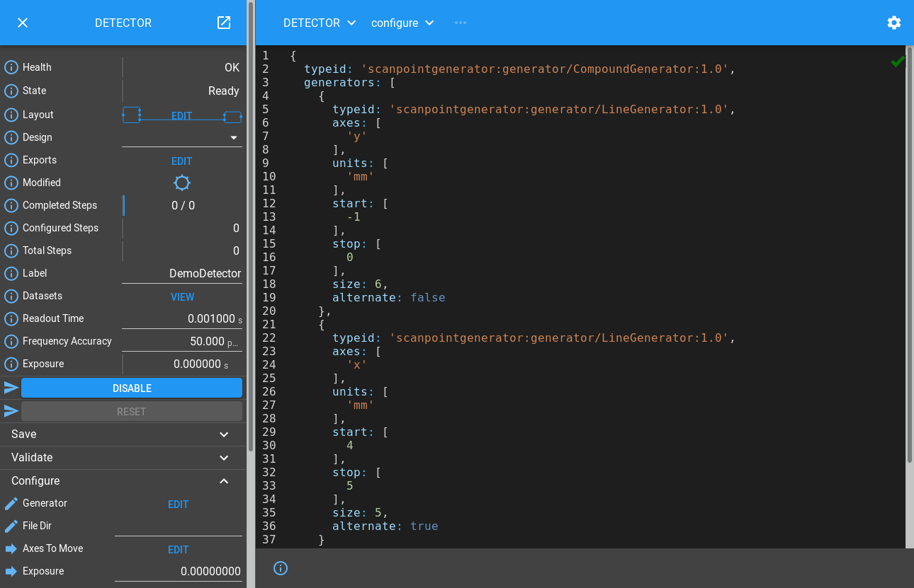

.. _detector_tutorial:

Detector Tutorial
=================

.. module:: malcolm.core

You should already know how to create a `part_` that can be instantiated
multiple times in a `ManagerController` with each instance creating
a `block_` in the `device_layer_` below.
In the example we exposed a simple interface with a couple of
`Methods <method_>` to simulate a Motion Controller. We will now build an
interface that looks like a Detector, taking a scan specification, and writing
data to an HDF file. To do this, we will introduce a new configure/run interface
that will make using these detectors in a scan more straightforward. The
configure stage is where as much setup as possible is done, then the run stage
is a supervisory stage where the scan is performed.

Specifying Scan Points
----------------------

If this Detector Block is going to simulate running a scan, we need to learn
how to specify a scan. There are a number of pieces of information about each
point in a scan that are needed by Malcolm:

- The demand positions of a number of actuators representing where they should
  be at the  mid-point of a detector frame. This is needed for step scans and
  continuous scans.
- The demand positions of those actuators at the upper and lower bounds (start
  and end) of that detector frame. This is only needed for continuous scans
  where each detector frame is taken while the actuators were moving rather than
  a step scan where they are static.
- The index in the data file that the frame should be stored. For grid based
  scans (like a snake scan) these will have the same dimensions as the demand
  positions. For non grid based scans (like a spiral scan) these will have
  less dimensions because the datapoints do not fit onto a regular grid.
- The duration of the frame. This is needed for continuous scans and is the
  time taken to get from the lower to the upper bound.

The size of each index dimension and units for each actuator are also
needed for file writing.

Rather than passing all this information in one large structure, a separate
project called `Scan Point Generator`_ has been setup to create parameterized
generators which work together to generate multi-dimensional scan paths. We
will make our Detector Block understand these generators.

Creating Runnable Device Blocks
-------------------------------

Let's take a look at the `process_definition_`
``./malcolm/modules/demo/DEMO-DETECTOR.yaml``:

.. literalinclude:: ../../malcolm/modules/demo/DEMO-DETECTOR.yaml
    :language: yaml

Again, apart from the web server there is just one Block, specified in
``./malcolm/modules/demo/blocks/detector_block.yaml``:

.. literalinclude:: ../../malcolm/modules/demo/blocks/detector_block.yaml
    :language: yaml

We instantiate a `DatasetTablePart` to report the datasets that we will write
(see `datasets`),
a `FileWritePart` to write some dummy data to an HDF file, and then use a
`RunnableController` to construct our Block.

We also instantiate a `LabelPart` which simply allows us to give this detector
a human readable label (a couple of words long) that is suitable
for display on GUIs.

This produces a single ``DETECTOR`` Device Block.

.. note::
    Unlike the previous example, there are no Child Blocks in the
    `hardware_layer_`. This is because we are making a cut down demo, in a real
    example like in the `areadetector_tutorial` we would have child Blocks and
    multiple parts to control them.

Controller for Runnable Device Blocks
-------------------------------------

As well as controlling child Blocks, our Block needs to respond to a
configure()/run() interface. A `RunnableController` implements this interface.
It inherits `ManagerController`, so has all the Attributes and Methods we
introduced in the `motion_tutorial`, as well as the following Attributes:

.. list-table::
    :widths: 20, 80
    :header-rows: 1

    * - Attribute
      - Description

    * - ``completedSteps``
      - Readback of the last completed ScanPointGenerator step number in
        the current scan. Also accepts Put when configured to seek to a
        different step in the scan

    * - ``configuredSteps``
      - The last configured step that will be complete when run() returns
        successfully

    * - ``totalSteps``
      - The total number of steps contained in the current ScanPointGenerator.
        This will be different to ``configuredSteps`` if Malcolm is not being
        asked to move all the axes in the generator

And the following Methods:

.. list-table::
    :widths: 20, 80
    :header-rows: 1

    * - Method
      - Description

    * - ``validate``
      - Check that a set of scan parameters are valid for a run

    * - ``configure``
      - Configure the device ready for a run

    * - ``run``
      - Run a device where configure has already been called

    * - ``abort``
      - Abort the current operation

    * - ``pause``
      - Pause the current Run, reconfiguring around the last good step

    * - ``resume``
      - Resume a paused run

It implements the following complicated looking state machine:

.. graphviz:: ../build/scanning/runnable_states.dot

The main thing to get from this diagram is that the Block passes through a
number of states while it is being ``configure()d`` and ``run()``, and these
states control the Methods that can be run at any time.

Adding functionality to a RunnableController
--------------------------------------------

Now let's see some of the Methods and Attributes that are created in our
example:

.. digraph:: detector_controllers_and_parts

    newrank=true;  // Sensible ranking of clusters
    bgcolor=transparent
    node [fontname=Arial fontsize=10 shape=rect style=filled fillcolor="#8BC4E9"]
    graph [fontname=Arial fontsize=11]
    edge [fontname=Arial fontsize=10 arrowhead=none]

    controller [label=<RunnableController mri: 'DETECTOR'>]
    detpart [label=<FileWritePart name: 'FW'>]
    dspart [label=<DatasetTablePart name: 'DSET'>]

    subgraph cluster_control {
        label="Control"
        labelloc="b"
        controller -> detpart
        controller -> dspart
    }

    block [label=<Block mri: 'DETECTOR'>]
    datasets [label=<Attribute name: 'datasets'>]
    configure [label=<Method name: 'configure'>]
    run [label=<Method name: 'run'>]

    subgraph cluster_view {
        label="View"
        labelloc="b"
        block -> datasets
        block -> configure
        block -> run
    }

    {rank=same;controller block}
    {rank=same;dspart detpart datasets configure run}

    dspart -> datasets [style=dashed]
    controller -> configure [style=dashed]
    controller -> run [style=dashed]
    controller -> block [arrowhead=vee dir=from style=dashed label=produces]

The `RunnableController` contributes the ``configure`` and ``run`` Methods in a
similar way to previous examples, and the DatasetTablePart contributes a
``datasets`` Attribute, but the FileWritePart doesn't contribute any Attributes
or Methods to the Block. Instead, it registers functions with `Hooks <hook_>`
on the Controller to execute arbitrary logic at the correct stage of
`RunnableController.configure` or `RunnableController.run`.

Hooking into configure()
------------------------

We mentioned earlier that a Part can register hook functions.
Each hook function is called at at a specific phase of a specific Method
provided by the Controller. Lets take a look at the first
part of ``./malcolm/modules/demo/parts/filewritepart.py`` to see how this
works:

.. literalinclude:: ../../malcolm/modules/demo/parts/filewritepart.py
    :language: python
    :end-before: # For docs: Before run

Again we override ``__init__``, but after initializing some
`protected variables`_ we have some `hook_` statements in the ``setup()``
function. These call :meth:`~PartRegistrar.hook` to register a function to be
run with one or more `Hook` classes. A Controller defines a a number of Hooks
that define what methods of a Part will be run during a particular Method. For
example, we are hooking our ``configure()`` method to the `ConfigureHook`.

Let's take a look at its documentation:

.. autoclass:: malcolm.modules.scanning.hooks.ConfigureHook
    :noindex:

What happens in practice is that when ``DETECTOR.configure()`` is called, all
the functions hooked to `ConfigureHook` will be called concurrently. They will
each be called with the arguments that they ask for (as long as its name appears
in the documentation for the Hook).

.. seealso::
    `statesets` contains more information about which Hooks are run in each
    state transition

Passing Infos back to the Controller
------------------------------------

You may have noticed that ``configure()`` takes extra ``fileDir``,
``formatName`` and ``fileTemplate`` arguments that are not documented in the
Hook. How does the Controller know to ask for them at configure and pass them
down to us? Well in ``setup()`` we report an `info_`. This is a way of telling
our parent Controller something about us, either in response to a `hook_`, or
asynchronously using `PartRegistrar.report`. In this case, we call
`ConfigureHook.create_info` which scans our ``configure`` method for extra
arguments and puts them in a `ConfigureParamsInfo` object that we can
``report()`` back. The docstring for this info explains what the Controller
will do with this:

.. autoclass:: malcolm.modules.scanning.infos.ConfigureParamsInfo
    :noindex:

After we have created our HDF file in configure, we make some more infos in
``_create_infos``:

.. literalinclude:: ../../malcolm/modules/demo/parts/filewritepart.py
    :language: python
    :pyobject: FileWritePart._create_infos

This time they describe the datasets that we are going to produce. These will
be used by the DatasetTablePart to put them in an Attribute that can be read
by the client expecting a scan. The docstring for this info explains this:

.. autoclass:: malcolm.modules.scanning.infos.DatasetProducedInfo
    :noindex:

In our case we will produce a main dataset, with a detector of the dimensions
given when we instantiated the part, a sum dataset which will provide a
suitable single point for each detector frame to live visualize the scan, and
the axis setpoints of everything that moves in the scan.

Hooking into run()
------------------

We also hooked our ``run()`` method in ``__init__``. Let's take a look at
what it does:

.. literalinclude:: ../../malcolm/modules/demo/parts/filewritepart.py
    :language: python
    :pyobject: FileWritePart.run

This is hooked to the `RunHook`. Let's take a look at its documentation:

.. autoclass:: malcolm.modules.scanning.hooks.RunHook
    :noindex:

Walking through the code we can see that we are iterating through each of the
step indexes that we need to produce, getting a `scanpointgenerator.Point`
object for each one. We then write some suitable data based on this point to
our file. After this we work out how long we need to wait until the next
position is to be produced, then do an interruptable sleep. It is important that
we use the ``context`` parameter to do this, because if the Controller is
aborted, it will tell every `Context` it passed out to hooked functions to
abort. Finally we :meth:`~PartRegistrar.report` a `RunProgressInfo` with the
current step number so the client knows how much of the scan is complete.

.. important:: Step numbers in Malcolm are 1-indexed, so a value of 0 means no
    steps completed.

The Controller will use all of the `RunProgressInfo` instances to work out
how far the actual scan has progressed, and report it in the Block's
``currentStep`` Attribute.

Hooking into seek(), abort() and reset()
----------------------------------------

The ``seek()`` Method stores completed_steps, and steps_to_do, then calculates
a new UID offset so that any new frames are guaranteed to have an ID that has
never been written before:

.. literalinclude:: ../../malcolm/modules/demo/parts/filewritepart.py
    :language: python
    :pyobject: FileWritePart.seek

It is hooked into two Hooks:

.. autoclass:: malcolm.modules.scanning.hooks.SeekHook
    :noindex:

.. autoclass:: malcolm.modules.scanning.hooks.PostRunArmedHook
    :noindex:

Which means it will be called at when ``pause()`` is called, and when Malcolm
has been asked to setup the next phase of a scan where it only moves a subset
of the axes in the generator.

The ``reset()`` Method just closes the HDF file if it isn't already closed:

.. literalinclude:: ../../malcolm/modules/demo/parts/filewritepart.py
    :language: python
    :pyobject: FileWritePart.reset

It again is hooked into two Hooks:

.. autoclass:: malcolm.modules.scanning.hooks.AbortHook
    :noindex:

.. autoclass:: malcolm.modules.builtin.hooks.ResetHook
    :noindex:

These will be called when ``reset()`` or ``abort()`` is called on the Block.

Running the demo
----------------

.. highlight:: ipython

Let's run up the example and give it a go::

    [me@mypc pymalcolm]$ ./malcolm/imalcolm.py malcolm/modules/demo/DEMO-DETECTOR.yaml
    Loading...
    Python 2.7.13 (default, Oct  3 2017, 11:17:53)
    Type "copyright", "credits" or "license" for more information.

    IPython 5.4.1 -- An enhanced Interactive Python.
    ?         -> Introduction and overview of IPython's features.
    %quickref -> Quick reference.
    help      -> Python's own help system.
    object?   -> Details about 'object', use 'object??' for extra details.

    Welcome to iMalcolm.

    self.mri_list:
        ['COUNTERX', 'COUNTERY', 'TICKER', 'WEB']

    # To create a view of an existing Block
    block = self.block_view("<mri>")

    # To create a proxy of a Block in another Malcolm
    self.make_proxy("<client_comms_mri>", "<mri>")
    block = self.block_view("<mri>")

    # To view state of Blocks in a GUI
    !firefox localhost:8008

    In [1]:

Then enter::

    In [1]: from scanpointgenerator import LineGenerator, CompoundGenerator

    In [2]: from scanpointgenerator.plotgenerator import plot_generator

    In [3]: yline = LineGenerator("y", "mm", -1, 0, 6)

    In [4]: xline = LineGenerator("x", "mm", 4, 5, 5, alternate=True)

    In [5]: generator = CompoundGenerator([yline, xline], [], [], duration=0.5)

We can then see what this generator looks like::

    In [6]: plot_generator(generator)

.. image:: detector_0.png

What we have done here is set up a scan that is 6 rows in y and 5 columns in x.
The x value will snake forwards and backwards, and the y value will increase
at the end of each x row. We have told it that each scan point should last for
0.5 seconds, which should give us enough time to see the ticks. If this is the
scan that we wanted to do then we can either configure from the terminal, or
dump the JSON so we can use the GUI. Let's do the latter::

    In [7]: from annotypes import json_encode

    In [8]: json_encode(generator)
    Out[8]: '{"typeid": "scanpointgenerator:generator/CompoundGenerator:1.0", "generators": [{"typeid": "scanpointgenerator:generator/LineGenerator:1.0", "axes": ["y"], "units": ["mm"], "start": [0.0], "stop": [1.0], "size": 6, "alternate": false}, {"typeid": "scanpointgenerator:generator/LineGenerator:1.0", "axes": ["x"], "units": ["mm"], "start": [0.0], "stop": [1.0], "size": 5, "alternate": true}], "excluders": [], "mutators": [], "duration": 0.5, "continuous": true}'

Then we can open http://localhost:8008/gui/DETECTOR to see the **DETECTOR**
Block on the left. If we expand the Configure method and click Edit by the
Generator field we can paste in our JSON:

If we set fileDir to "/tmp", then click Configure, we will see the State change
to Armed. We can then click on the "VIEW" button next to "Datasets" to see
what the detector will write. Here we see that it will make a primary dataset
in (containing detector data) ``/entry/data``, and a secondary dataset
(containing summary data calculated from the detector data) ``/entry/sum``. It
will also write position_set datasets for ``x`` and ``y`` containing the
generator positions to ``/entry/x_set`` and ``/entry/y_set``. All of these
will be written to a file called ``det.h5`` in the fileDir:

.. image:: detector_2.png

If we click on the info icon next to the "Completed Steps", and then
select the Plot tab, then click the "Run" button on the left pane we will see
the scan be performed:

.. image:: detector_3.png

We can then view the data that the detector wrote from our iPython terminal.
We read the HDF file we have produced, copy the dataset, close the file, and
check the shape of the dataset to see that it does indeed have rank 4::

    In [13]: import h5py

    In [10]: with h5py.File("/tmp/det.h5") as f:
        ...:     im = f["/entry/sum"][:]
        ...:

    In [11]: im.shape
    Out[11]: (6, 5, 1, 1)

The sum dataset has the same rank as the detector data, so we need to squash
those last two dimensions down so that we can plot it. We do that using the
reshape function, then we show the resulting (6, 5) dataset::

    In [12]: from pylab import imshow, show

    In [13]: imshow(im.reshape(im.shape[:2]))
    Out[13]: <matplotlib.image.AxesImage at 0x7f11a300b090>

    In [14]: show()

From here you can try modifying the generator to make a bigger, faster scan,
pressing Configure then Run again.

Conclusion
----------

This tutorial has given us an understanding of how scans are specified in
Malcolm, the configure/run State Machine that Malcolm implements, and
how Parts can register code to run at different phases of a Controller.
In the next tutorial we will see how to create a Block in the
`scan_layer_` to co-ordinate a detector and a motion controller.

.. _protected variables:
    https://radek.io/2011/07/21/private-protected-and-public-in-python