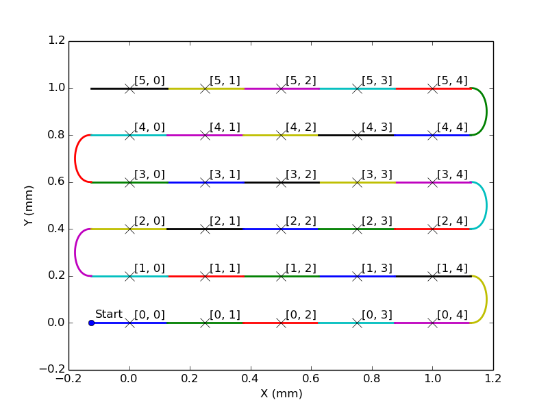
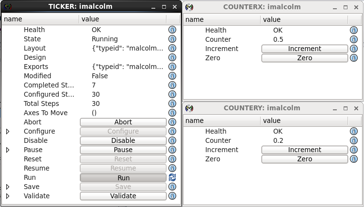
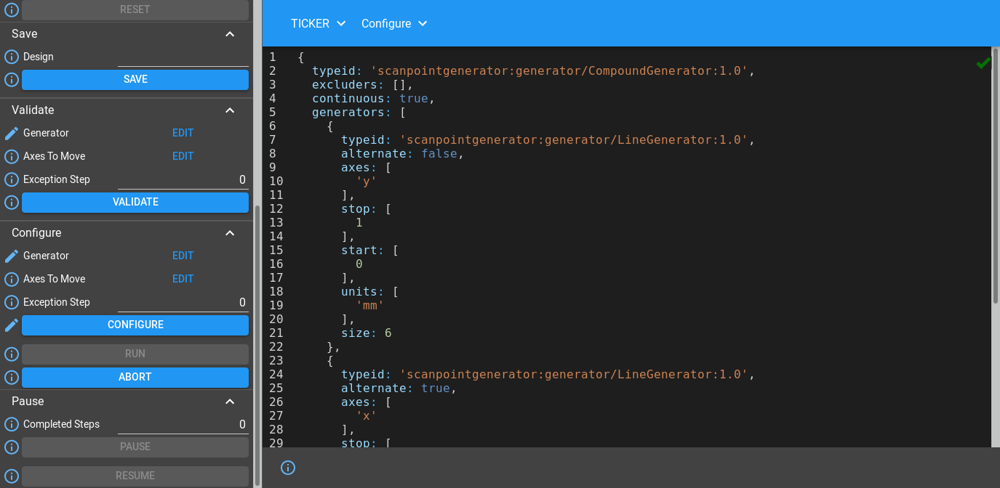
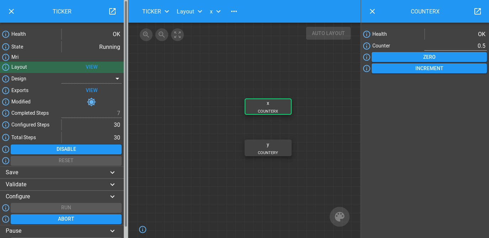
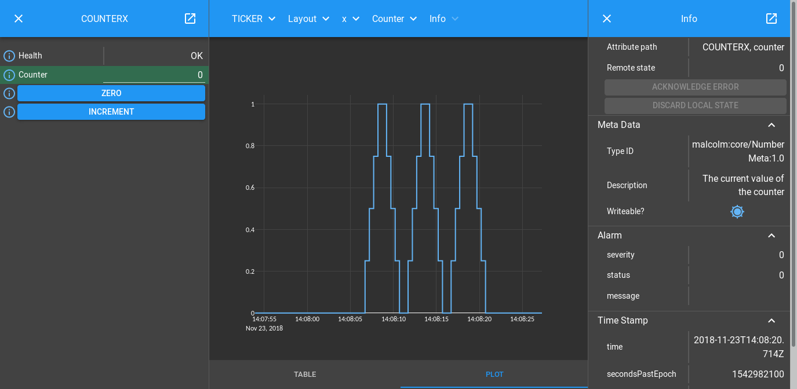

.. _generator_tutorial:

Generator Tutorial
==================

.. module:: malcolm.core

You should already know how to create a `part_` that attaches `Attributes
<attribute_>` and `Methods <method_>` to a `block_`. The Blocks we have made in
previous tutorials are quite simple and low level and might correspond to the
interface provided by EPICS devices: a collection of Attributes that we can set
and simple Methods we can call that cause the device to operate in a particular
way. We call Blocks like this the `hardware_layer_`. What is missing from these
Hardware Blocks is the logic of "do this, then that, then these 3 things at the
same time". To do this, we will create a higher level `device_layer_` containing
Blocks that will control a number of child Hardware Blocks to synchronise them
and use them for a particular application.

Creating Device Blocks
----------------------

These higher level Blocks have two main methods:

- configure(params): Take a set of parameters and configure all child Blocks
  according to these parameters. This operation should include as much as
  possible of the setup of the device, without actually starting a scan.
- run(): When all devices taking part in the scan have configured themselves,
  this method will start the scan going. It supervises the actions of the
  scan, providing status monitoring and any periodic actions that need to
  happen.

The application we have chosen for this tutorial is a ScanTicker. It will take
the specification for a scan then use a number of Counter blocks, that we saw in
the last tutorial, setting them to the demand positions of the axes in the
scan. This will look a little like a Motor Controller performing a scan.

Let's take a look at the Process definition ``./malcolm/modules/demo/DEMO-TICKER.yaml``:

.. literalinclude:: ../../malcolm/modules/demo/DEMO-TICKER.yaml
    :language: yaml

That's not very exciting, we just load a single Ticker Block and a Comms
object. Let's look at ``./malcolm/modules/demo/blocks/ticker_block.yaml`` to
see what one of those does:

.. literalinclude:: ../../malcolm/modules/demo/blocks/ticker_block.yaml
    :language: yaml

We instantiate two Counter blocks (``COUNTERX`` and ``COUNTERY``) and
instantiate two ScanTickerParts (``x`` and ``y``) that will connect to them.
We then use a `RunnableController` to construct our Block.

This tree of Blocks is probably better viewed as a diagram:

.. digraph:: ticker_child_connections

    bgcolor=transparent
    compound=true
    node [fontname=Arial fontsize=10 shape=Mrecord style=filled fillcolor="#8BC4E9"]
    graph [fontname=Arial fontsize=10]
    edge [fontname=Arial fontsize=10 arrowhead=vee]

    subgraph cluster_device {
        label="Device Layer"
		style=filled
		color=lightgrey

        subgraph cluster_ticker {
            label="TICKER"
            ranksep=0.1
		    color=white
            ticker_c [label="RunnableController"]
            x [label="{ScanTickerPart|name: 'x'}"]
            y [label="{ScanTickerPart|name: 'y'}"]
            ticker_c -> x [style=invis]
            ticker_c -> y [style=invis]
        }
    }

    subgraph cluster_hardware {
        label="Hardware Layer"
		style=filled
		color=lightgrey

        subgraph cluster_counterx {
            label="COUNTERX"
            color=white
            counterx_c [label="BasicController"]
            counterx_p [label="CounterPart"]
            counterx_c -> counterx_p [style=invis]
        }

        subgraph cluster_countery {
            label="COUNTERY"
            color=white
            countery_c [label="BasicController"]
            countery_p [label="CounterPart"]
            countery_c -> countery_p [style=invis]
        }
    }

    x -> counterx_c [lhead=cluster_counterx minlen=3 style=dashed]
    y -> countery_c [lhead=cluster_countery minlen=3 style=dashed]

Now let's see some of the Methods and Attributes that are created:

.. digraph:: ticker_controllers_and_parts

    bgcolor=transparent
    node [fontname=Arial fontsize=10 shape=box style=filled fillcolor="#8BC4E9"]
    graph [fontname=Arial fontsize=11]
    edge [fontname=Arial fontsize=10 arrowhead=none]

    controller [shape=Mrecord label="{RunnableController|mri: 'TICKER'}"]
    tpart1 [shape=Mrecord label="{ScanTickerPart|name: 'x'}"]
    tpart2 [shape=Mrecord label="{ScanTickerPart|name: 'y'}"]

    subgraph cluster_control {
        label="Control"
        labelloc="b"
        controller -> tpart1
        controller -> tpart2
    }

    block [shape=Mrecord label="{Block|mri: 'TICKER'}"]
    configure [shape=Mrecord label="{Method|name: 'configure'}"]
    run [shape=Mrecord label="{Method|name: 'run'}"]
    state [shape=Mrecord label="{Attribute|name: 'state'}"]

    subgraph cluster_view {
        label="View"
        labelloc="b"
        block -> configure
        block -> run
        block -> state
    }

    {rank=same;controller block}

    controller -> state [style=dashed]
    controller -> configure [style=dashed]
    controller -> run [style=dashed]
    controller -> block [arrowhead=vee dir=from style=dashed label=produces]

The `RunnableController` contributes the ``configure`` and ``run``
Methods in a similar way to previous examples, but the two ScanTickerParts do
not contribute any Attributes or Methods to the Block. Instead, these register
functions with `Hooks <hook_>` on the Controller to
make their child Block behave in a particular way during the correct phase of
`RunnableController.configure` or `RunnableController.run`.

Specifying Scan Points
----------------------

If this ScanTicker Block is going to simulate running a scan, we better learn
how to specify a scan. There are a number of pieces of information about each
point in a scan that are needed by Malcolm:

- The demand positions of a number of actuators representing where they should
  be at the  mid-point of a detector frame. This is needed for step scans and
  continuous scans.
- The demand positions of those actuators at the upper and lower bounds (start
  and end) of that detector frame. This is needed for continuous scans only so
  that each detector frame is taken while the actuators were moving at a
  constant velocity.
- The index in the data file that the frame should be stored. For grid based
  scans (like a snake scan) these will have the same dimensions as the demand
  positions. For non grid based scans (like a spiral scan) these will have
  less dimensions because the datapoints do not fit onto a regular grid.
- The duration of the frame. This is needed for continuous scans and is the
  time taken to get from the lower to the upper bound.

The size of each index dimension and units for each actuator are also
needed for file writing.

Rather than passing all this information in one large structure, a separate
project called `Scan Point Generator`_ has been setup to create parameterized
generators which work together to generate multi-dimensional scan paths. We
will make our ScanTicker Block understand these generators.

Hooking into configure()
------------------------

We mentioned earlier that a Part can register functions to run the correct
phase of Methods provided by the Controller. Lets take a look at the first
part of ``./malcolm/modules/demo/parts/scantickerpart.py`` to see how this
works:

.. literalinclude:: ../../malcolm/modules/demo/parts/scantickerpart.py
    :language: python
    :end-before: # Run scan

Again we override ``__init__``, but after initializing some
`protected variables`_ we have some `hook_` statements. These call
:meth:`~Part.register_hooked` to register a function to be run with one or more
`Hook` classes. A Controller defines a a number of Hooks that define what
methods of a Part will be run during a particular Method. For example, we are
hooking our ``configure()`` method to the `ConfigureHook`.

Let's take a look at its documentation:

.. autoclass:: malcolm.modules.scanning.hooks.ConfigureHook
    :noindex:

What happens in practice is that when ``TICKER.configure()`` is called, all the
functions hooked to `ConfigureHook` will be called concurrently. They will each
be called with the arguments that they ask for (as long as its name appears in
the documentation for the Hook). Our ScanTicker ``configure()`` method simply
stores the relevant information so that the ``run()`` method can operate on it.

Passing Infos back to the Controller
------------------------------------

You may have noticed that ``configure()`` takes an extra ``exceptionStep``
argument, how does the Controller know to pass this? Well in ``setup()`` we
report an `info_`. This is a way of telling our parent Controller something
about us, either in response to a `hook_`, or asynchronously using
`PartRegistrar.report`. In this case, we call `ConfigureHook.create_info` which
scans our ``configure`` method for extra arguments and puts them in a
`ConfigureParamsInfo` object that we can ``report()`` back. The docstring
for this info explains what the Controller will do with this:

.. autoclass:: malcolm.modules.scanning.infos.ConfigureParamsInfo
    :noindex:

Hooking into run()
------------------

We also hooked our ``run()`` method in ``__init__``. Let's take a look at
what it does:

.. literalinclude:: ../../malcolm/modules/demo/parts/scantickerpart.py
    :language: python
    :start-after: # Run scan

This is hooked to the `RunHook`. Let's take a look at its documentation:

.. autoclass:: malcolm.modules.scanning.hooks.RunHook
    :noindex:

Walking through the code we can see that we are iterating through each of the
step indexes that we need to produce, getting a `scanpointgenerator.Point`
object for each one. We then pick out the position of the current axis, and use
the `Context` to create a `Block` view that we use put the ``counter`` value. It
is important that we use ``context`` parameter to because this is interruptable.
The `Context` helper can also do asynchronous puts and puts to multiple
attributes at the same time.

After we have done the put, we work out how long we need to wait until the
next position is to be produced, then do an interruptable sleep. Finally we
:meth:`~PartRegistrar.report` a `RunProgressInfo` with the current step number.

.. note:: Step numbers in Malcolm are 1-indexed, so a value of 0 means no steps
    completed.

The Controller will use all of the `RunProgressInfo` instances to work out
how far the actual scan has progressed, and report it in the Block's
``currentStep`` Attribute.

.. highlight:: ipython

Let's run up the example and give it a go::

    [me@mypc pymalcolm]$ ./malcolm/imalcolm.py malcolm/modules/demo/DEMO-TICKER.yaml
    Loading...
    Python 2.7.3 (default, Nov  9 2013, 21:59:00)
    Type "copyright", "credits" or "license" for more information.

    IPython 2.1.0 -- An enhanced Interactive Python.
    ?         -> Introduction and overview of IPython's features.
    %quickref -> Quick reference.
    help      -> Python's own help system.
    object?   -> Details about 'object', use 'object??' for extra details.

    Welcome to iMalcolm.

    self.mri_list:
        ['COUNTERX', 'COUNTERY', 'TICKER', 'WEB']

    Try:
    hello = self.block_view("HELLO")
    print hello.greet("me")

    or

    gui(self.block_view("COUNTER"))

    or

    self.make_proxy("localhost:8008", "HELLO")
    print self.block_view("HELLO").greet("me")

    In [1]:

Then enter::

    In [1]: from scanpointgenerator import LineGenerator, CompoundGenerator

    In [2]: from scanpointgenerator.plotgenerator import plot_generator

    In [3]: yline = LineGenerator("y", "mm", 0., 1., 6)

    In [4]: xline = LineGenerator("x", "mm", 0., 1., 5, alternate=True)

    In [5]: generator = CompoundGenerator([yline, xline], [], [], duration=0.5)

We can then see what this generator looks like::

    In [6]: plot_generator(generator)

What we have done here is set up a scan that is 6 rows in y and 5 columns in x.
The x value will snake forwards and backwards, and the y value will increase
at the end of each x row. We have told it that each scan point should last for
0.5 seconds, which should give us enough time to see the ticks. If this is the
scan that we wanted to do then we can either configure from the terminal, or
dump the JSON so we can use the GUI. Let's do the latter::

    In [7]: from malcolm.core import json_encode

    In [8]: json_encode(generator)
    Out[8]: '{"typeid": "scanpointgenerator:generator/CompoundGenerator:1.0", "excluders": [], "continuous": true, "generators": [{"typeid": "scanpointgenerator:generator/LineGenerator:1.0", "alternate": false, "axes": ["y"], "stop": [1.0], "start": [0.0], "units": ["mm"], "size": 6}, {"typeid": "scanpointgenerator:generator/LineGenerator:1.0", "alternate": true, "axes": ["x"], "stop": [1.0], "start": [0.0], "units": ["mm"], "size": 5}], "duration": 0.5, "mutators": []}'

Then we can open http://localhost:8008/gui/TICKER/layout to see the **TICKER**
Block on the left, and the layout of child Blocks in the centre. If we then
click AutoLayout we can see more clearly, and clicking on one of the Blocks
will display it in the right pane:

If we expand the Configure method and click Edit by the Generator field we can
paste in our JSON:

We can then click Configure and we will see the State change to Armed. If we
go back to the layout view and select the x block again, then click Run we will
see the scan be performed:

We can then click on the info icon next to the counter attribute in the right
hand window to see a table or plot of the values that the ticker went to:

From here you can try pausing, resuming and seeking within the scan. If you want
to re-run the scan you will need to click Configure again.

.. seealso::
    `RunnableStates` has more information about what functions you can
    run in different Block states.

What is happening under the hood is that our hooked ``configure()`` method is
being called during ``pause()``, ``configure()`` and ``seek()``, but we want it
to do the same thing each time so can use the same method.  The ``run()``
command is likewise hooked to both ``run()`` and ``resume()`` as it makes no
difference in our example. In a real example, there may be some device state
that would mean different things need to be run in these two hooks.

Conclusion
----------

This tutorial has given us an understanding of how scans are specified in
Malcolm, how child Hardware Blocks are controlled from a parent Device Block and
how Parts can register code to run at different phases of a Controller. In the
next tutorial we will see how to make an `EPICS`_ `areaDetector`_ Block in the
`device_layer_` capable of performing scans.

.. _protected variables:
    https://radek.io/2011/07/21/private-protected-and-public-in-python