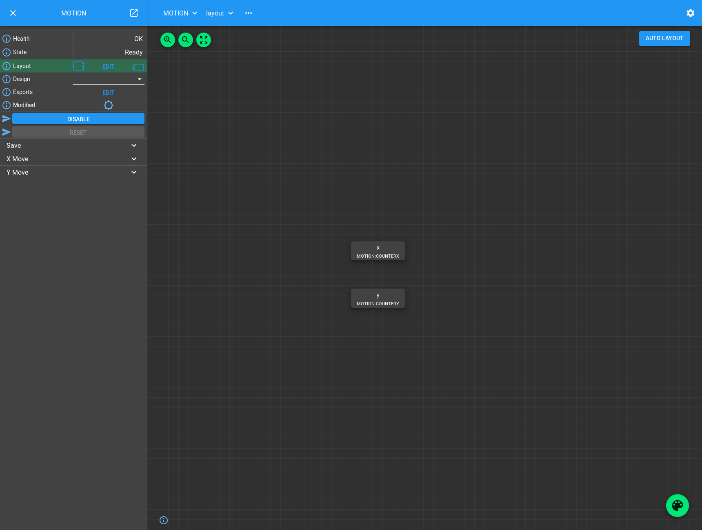
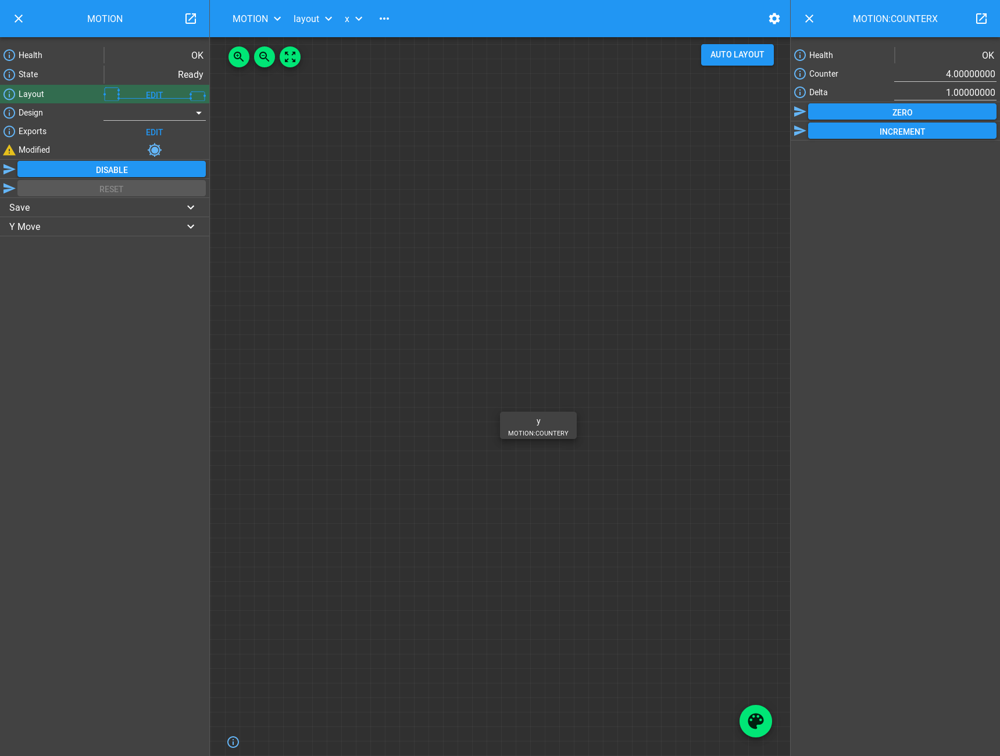
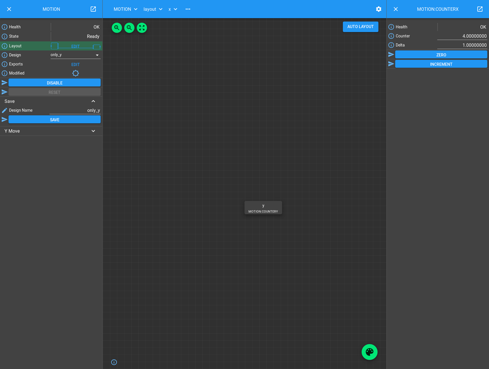

.. _motion_tutorial:

Motion Tutorial
===============

You should already know how to create a `part_` that attaches `Attributes
<attribute_>` and `Methods <method_>` to a `block_`. The Blocks we have made in
previous tutorials are quite simple and low level and might correspond to the
interface provided by EPICS devices: a collection of Attributes that we can set
and simple Methods we can call that cause the device to operate in a particular
way. We call Blocks like this the `hardware_layer_`. To get more complicated
functionality we need to compose these together into a higher level
`device_layer_` containing Blocks that will control a number of child Hardware
Blocks to synchronise them and use them for a particular application.

In this tutorial we will build a simple Device Block that represents motion
controller hardware moving two motors. A pair of counter Blocks will serve as
"motors".

Creating Device Blocks
----------------------

Let's dive right in and look at the Process definition
``./malcolm/modules/demo/DEMO-MOTION.yaml``:

.. literalinclude:: ../../malcolm/modules/demo/DEMO-MOTION.yaml
    :language: yaml

Apart from the web server block, all that we do here is load a single Motion
Block. We have to look at ``./malcolm/modules/demo/blocks/motion_block.yaml`` to
see what one of those does:

.. literalinclude:: ../../malcolm/modules/demo/blocks/motion_block.yaml
    :language: yaml

We instantiate two Counter blocks (``$(mir):COUNTERX`` and ``$(mir):COUNTERY``)
and instantiate two MotorMoveParts (``x`` and ``y``) that will connect to them.
We then use a `ManagerController` to construct our Block.

This tree of Blocks is probably better viewed as a diagram:

.. digraph:: motion_child_connections

    newrank=true;  // Sensible ranking of clusters
    bgcolor=transparent
    compound=true
    node [fontname=Arial fontsize=10 shape=rect style=filled fillcolor="#8BC4E9"]
    graph [fontname=Arial fontsize=10]
    edge [fontname=Arial fontsize=10 arrowhead=vee]

    subgraph cluster_device {
        label="Device Layer"
		style=filled
		color=lightgrey

        subgraph cluster_ticker {
            label="MOTION"
            ranksep=0.1
		    color=white
            ticker_c [label="ManagerController"]
            x [label=<MotorMovePart name: 'x'>]
            y [label=<MotorMovePart name: 'y'>]
            ticker_c -> x [style=invis]
            ticker_c -> y [style=invis]
        }
    }

    subgraph cluster_hardware {
        label="Hardware Layer"
		style=filled
		color=lightgrey

        subgraph cluster_counterx {
            label="COUNTERX"
            color=white
            counterx_c [label="BasicController"]
            counterx_p [label="CounterPart"]
            counterx_c -> counterx_p [style=invis]
        }

        subgraph cluster_countery {
            label="COUNTERY"
            color=white
            countery_c [label="BasicController"]
            countery_p [label="CounterPart"]
            countery_c -> countery_p [style=invis]
        }
    }

    x -> counterx_c [lhead=cluster_counterx minlen=3 style=dashed]
    y -> countery_c [lhead=cluster_countery minlen=3 style=dashed]

.. note::
    Blocks in the Device layer create their child Blocks. This is because their
    children have only one logical parent, the Device they belong to.

Controller for Device Blocks
----------------------------

All Blocks in the Device Layer control child Blocks. A `controller_` that
provides functionality aimed at managing child Blocks is called a
`ManagerController`. It provides functionality like Load/Save, disabling and
enabling child Blocks, and a state machine to protect against these functions
being called at the wrong time.

It has the following Attributes:

.. list-table::
    :widths: 20, 80
    :header-rows: 1

    * - Attribute
      - Description

    * - ``health``
      - If something goes wrong, this will show the error message, otherwise it
        has the value "OK"

    * - ``state``
      - The current state the Block is in, determines which Methods and
        Attributes are writeable at present

    * - ``layout``
      - A Table of child Blocks, whether they are currently visible (enabled),
        and their X and Y positions for visualization in the web GUI

    * - ``design``
      - The current saved design name. It is a choice (populated at startup)
        of all the design names that have previously been saved. When selected
        it will restore the settings of the Block and its children to the
        contents of the design file

    * - ``exports``
      - A Table of extra child fields that can be promoted up to the parent,
        either for better visibility, or to provide part of the parent's
        interface to higher levels

    * - ``modified``
      - A read-only LED indicating if any of our settings or our children have
        changed since the last save

And the following Methods:

.. list-table::
    :widths: 20, 80
    :header-rows: 1

    * - Method
      - Description

    * - ``disable``
      - Disable any functionality, connections, and polling that the Block
        is currently doing

    * - ``reset``
      - If Disabled or in Fault state, clear any errors and restart any
        connections and polling that the Block normally does

    * - ``save``
      - Save the attributes of the parent and immediate children to a JSON
        file with the given design name, in a directory specified when the
        ManagerController was created.

And implements the following StateMachine:

.. graphviz:: ../build/builtin/manager_states.dot

Adding functionality to a ManagerController
-------------------------------------------

In the previous tutorials we have implemented a subclass of `Part` to add
functionality to our Controller. In this tutorial we have to manage a child
Block, so we will subclass `ChildPart`, which has functions to manage a single
child Block, like Load/Save.

The aim of this tutorial is to make something that looks like a motion
controller, so we will make our Part expose a single method "moveX" (or "moveY")
that will "move" it's child Block by doing a Put to the counter value.

We instantiate two parts, so here are the Methods and Attributes created:

.. digraph:: motion_controllers_and_parts

    newrank=true;  // Sensible ranking of clusters
    bgcolor=transparent
    node [fontname=Arial fontsize=10 shape=rect style=filled fillcolor="#8BC4E9"]
    graph [fontname=Arial fontsize=11]
    edge [fontname=Arial fontsize=10 arrowhead=none]

    controller [label=<ManagerController mri: 'MOTION'>]
    mpart1 [label=<MotorMovePart name: 'x'>]
    mpart2 [label=<MotorMovePart name: 'y'>]

    subgraph cluster_control {
        label="Control"
        labelloc="b"
        controller -> mpart1
        controller -> mpart2
    }

    block [label=<Block mri: 'DETECTOR'>]
    design [label=<Attribute name: 'design'>]
    save [label=<Method name: 'save'>]
    moveX [label=<Method name: 'moveX'>]
    moveY [label=<Method name: 'moveY'>]

    subgraph cluster_view {
        label="View"
        labelloc="b"
        block -> design
        block -> save
        block -> moveX
        block -> moveY
    }

    {rank=same;controller block}
    {rank=same;mpart1 mpart2 design save moveX moveY}

    mpart1 -> moveX [style=dashed]
    mpart2 -> moveY [style=dashed]
    controller -> design [style=dashed]
    controller -> save [style=dashed]
    controller -> block [arrowhead=vee dir=from style=dashed label=produces]

Lets take a look at ``./malcolm/modules/demo/parts/motormovepart.py`` to see
how it does this:

.. literalinclude:: ../../malcolm/modules/demo/parts/motormovepart.py
    :language: python

The first thing to note is the imports, we are pulling in a malcolm module
``builtin``. Anything that can be instantiated in a YAML file lives in a module
rather than in ``malcolm.core``. By convention we import modules by name into
our namespace rather than importing from them. This makes it clear where things
come from in the code. We also explicitly pull a couple of annotypes into our
namespace (as explained below) for annotating ``__init__``, and create an
annotype that we will use in our ``move()`` Method.

Moving on to the class definition, we see a decorator `no_save`. This defines
the set of Attributes of our child Counter Block that we will set with our
Methods and shouldn't appear in the design when we ``save()``. In this case
"counter" is the only Attribute we set and therefore don't want to save.

The MotorMovePart subclasses `ChildPart`, but this time we do some extra work in
the ``__init__`` method. Whenever we override ``__init__`` it is important to
call the ``__init__`` that we have just overridden, and that is what the
`super` call does. This is a Python construct that lets us reliably call methods
of our superclass that we have just overridden, even if multiple inheritance is
used. If someone instantiates MotorMovePart, then
``super(MotorMovePart, self).__init__`` will return the ``__init__`` function of
`ChildPart`, bound so that ``self`` does not need to be passed into it.

.. note::
    It's not necessary to understand what `super` does, but it is necessary to
    use it when you need to call the method you have just overridden, otherwise
    your class may not behave correctly if subclassed and multiple inheritance
    is used.

When overriding an ``__init__`` method we need to know what arguments to pass
to the base class and their types. Looking at the docs and sources of
``ChildPart.__init`` we can see:

.. autoclass:: malcolm.modules.builtin.parts.ChildPart
    :members: __init__
    :noindex:

.. literalinclude:: ../../malcolm/modules/builtin/parts/childpart.py
    :language: python
    :start-after: # For docs: before ChildPart init
    :end-before: # For docs: after ChildPart init

We need to pass ``name`` and ``mri`` straight down to the superclass, but
we know that a Counter Block is not stateful, so we can pass ``stateful=False``,
and we want the child Block to be immediately visible as soon as the parent
Block is initialized, so we pass ``initial_visibility=True``.

We also add a type comment to the ``__init__`` method that tells anyone using
the Part what parameters should be passed to the initializer. As we are passing
the arguments straight down to the superclass, we can reuse the annotypes, which
means we will inherit the description assigned to them.

.. note::
    We pull ``APartName`` and ``AMri`` into our namespace before using it in the
    ``__init__`` type comment. This is so that anyone who subclasses us can
    easily reuse the same annotypes without having to go up to our parent to
    get them.

In ``setup()`` we export a single Method, but as we are expecting to have
many of these Parts in a single Controller, we prefix the Method name with the
name of the Part, so it is unique in the Block. For our example, we have two
MotorMoveParts, ``x`` and ``y``, so the resulting Block should have ``xMove()``
and ``yMove()`` Methods.

Finally we define the ``move()`` Method. It takes a single argument ``demand``
which is describe by an annotype, and moves the motor instantly to the
demanded value by doing a Put to the counter value. Here we see a `Context` for
the first time. It is a utility object that makes us a Block view so we can
interact with our child Block. In future tutorials we will see that sometimes
we are passed one into a Method, but in this case we will use the Context that
is attached to the ``registrar`` object we were passed in ``setup()``. We
ask it for a Block view of the counter, then call the `Attribute.put_value`
method on the counter value.

How it looks in the GUI
-----------------------

Let's run up the demo and see how it looks in the GUI::

    [me@mypc pymalcolm]$ ./malcolm/imalcolm.py malcolm/modules/demo/DEMO-MOTION.yaml
    Loading...
    Python 2.7.13 (default, Oct  3 2017, 11:17:53)
    Type "copyright", "credits" or "license" for more information.

    IPython 5.4.1 -- An enhanced Interactive Python.
    ?         -> Introduction and overview of IPython's features.
    %quickref -> Quick reference.
    help      -> Python's own help system.
    object?   -> Details about 'object', use 'object??' for extra details.

    Welcome to iMalcolm.

    self.mri_list:
        ['MOTION:COUNTERX', 'MOTION:COUNTERY', 'MOTION', 'WEB']

    # To create a view of an existing Block
    block = self.block_view("<mri>")

    # To create a proxy of a Block in another Malcolm
    self.make_proxy("<client_comms_mri>", "<mri>")
    block = self.block_view("<mri>")

    # To view state of Blocks in a GUI
    !firefox localhost:8008

    In [1]:

Open http://localhost:8008 in your favourite browser and click on the "..."
button next to "Select a root block" to select the **MOTION** Block. You will
see the **MOTION** Block appear in the left hand pane:

If you click on the "Edit" button next to "Layout", then click "Auto Layout",
you will see the children of the MOTION Block, our two counter Blocks controlled
by parts named x and y:

Let's try a motor move. If you select the "x" Block by left clicking on it, a
right hand pane will pop out showing a view of the counter Block just like
we saw in the previous tutorial. If you expand the section on the left titled
"X Move", you will see a method that takes a single argument "Demand", and an
"X MOVE" button to run the method. Fill in a demand value and hit the button
and you will see the counter value change:

.. image:: motion_2.png

Deleting Blocks
---------------

Let's pretend that a motor is broken and we don't want to expose "X Move" any
more. We can do this by hiding it from the layout, so it doesn't contribute
to the Parent Block any more. If we click on "x" and hit the delete key, or
start dragging it to the bin that will appear in the bottom right of the screen,
then it will disappear. Refresh the screen, and you will now see that the
"X Move" Method has vanished:

This mechanism can be used to enable and disable Parts at runtime without
restarting Malcolm, and it opens the way for swapping between dynamic
configurations.

Load/Save
---------

To swap between dynamic configurations we use the concept of designs. The state
of the parent and it's immediate children can be saved to a file and restored
at a later date. These configurations are stored on a per Block basis.

If you look at the left hand sign of the screen you should see a "Modified" LED
which should be lit. This is saying that there are unsaved changes since either
startup or the last save. This is true, as we have deleted one of our parts.
Let's save our current design by expanding the "Save" section, filling in the
design name, and hitting "SAVE":

If we take a look at ``/tmp/MOTION/only_y.json`` we can see what got saved::

    {
      "attributes": {
        "layout": {
          "x": {
            "x": 0.0,
            "y": 0.0,
            "visible": false
          },
          "y": {
            "x": 0.0,
            "y": 58.30000305175781,
            "visible": true
          }
        },
        "exports": {}
      },
      "children": {
        "x": {
          "delta": 1.0
        },
        "y": {
          "delta": 1.0
        }
      }
    }

We can see that x is marked as not visible, and for both x and y we have saved
the "delta" value of the Blocks.

.. note::
    The counter value didn't get saved because we specified it in ``no_save``.
    If we had left this out, then each time the motor moved the modified LED
    would light, and when we restored a design the motor would move!

Let's try making some changes. Click on the "y" axis and change delta, then
click on the Palette and drag "x" back onto the screen. Then click on "y" and
we will see this:

Notice that "X Move" has reappeared, and tooltip for the Modified LED gives a
message about y.delta.value changing as well as the layout change. If we
re-select the Design to be "only_y" you should see the Modified LED clear, and
the X Block vanish. Refreshing the screen will show that the "X Move" Method has
gone again.

Conclusion
----------

This tutorial has given us an understanding of how ManagerControllers can be
used to create Device Blocks that control child Hardware Blocks, how ChildParts
can be turned on and off at runtime, and settings loaded and saved to make
designs. In the next tutorial we will see another more complicated Device
Block that implements a configure/run type interface.

