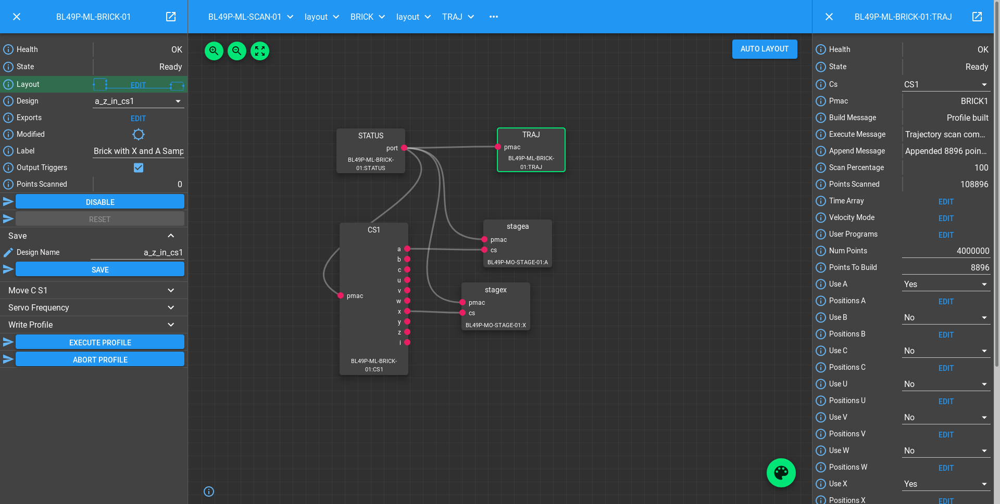
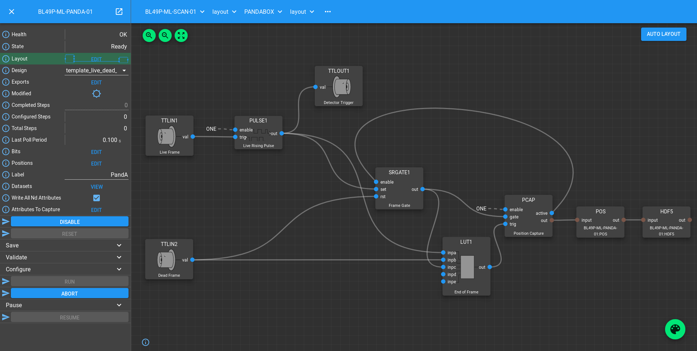

.. _panda_tutorial:

PandA Tutorial
==============

You should already know how to create a `block_` in the `scan_layer_` that
can control a Delta Tau PMAC, sending triggers to a PandABox_ and capturing
encoder positions. We now move onto using the PandA in a more intelligent way,
listening to the encoder positions, and generating the trigger stream itself.

EPICS Prerequisites
-------------------

We assume for this tutorial that you have created one or more IOCS that contain:

- A GeoBrick Controller template from the `EPICS pmac`_ module with PV prefix
  that looks like ``BLxxI-MO-BRICK-01``.
- A GeoBrick Trajectory template with the same prefix.
- One or more CS templates.
- One or more dls_pmac_asyn_motor or dls_pmac_cs_asyn_motor instances.
- An ADPandABlocks template from the `ADPandaBlocks`_ module with a PV prefix
  that looks like ``BLxxI-MO-PANDA-01:DRV:``
- NDPosPlugin and NDFileHDF5 `areaDetector`_ plugins with the PV prefixes of
  ``BLxxI-MO-PANDA-01:POS:`` and ``BLxxI-MO-PANDA-01:HDF5:``

Make a Malcolm directory for a beamline
---------------------------------------

The first thing we need is a directory for our beamline specific Blocks and
`process_definition_` to live in. At DLS we will typically make a directory
``etc/malcolm`` in the ``BL`` IOC directory for this purpose, but it could be
anywhere. We will refer to this directory as ``etc/malcolm`` for the rest of
the tutorial. We will also create an ``etc/malcolm/blocks`` subdirectory for
any beamline specific Blocks we create.

Define the Process Definition
-----------------------------

.. highlight:: yaml

Let's make a Process Definition in ``etc/malcolm/BLxxI-ML-MALC-01.yaml``::

    #!/dls_sw/prod/common/python/RHEL7-x86_64/pymalcolm/4-0/malcolm/imalcolm.py

    # Define the directory that this YAML file lives in as a Malcolm module
    # so we can use Blocks defined there as BLxxI.blocks.yyy
    - builtin.defines.module_path:
        name: BLxxI
        path: $(yamldir)

    # This is where all the saved and loaded designs will live
    - builtin.defines.string:
        name: config_dir
        value: /dls_sw/ixx/epics/malcolm

    # Define the motion controllers
    - BLxxI.blocks.brick01_block:
        mri_prefix: BLxxI-ML-BRICK-01
        pv_prefix: BLxxI-MO-BRICK-01
        config_dir: $(config_dir)

    # More motion controllers here...

    # Define the Detectors
    - ADPandABlocks.blocks.panda_runnable_block:
        mri_prefix: BLxxI-ML-PANDA-01
        pv_prefix: BLxxI-MO-PANDA-01
        hostname: blxxi-mo-panda-01
        config_dir: $(config_dir)

    # More non-panda detectors here...

    # Define the Scans
    - BLxxI.blocks.pmac_master_scan_block:
        mri_prefix: BLxxI-ML-SCAN-01
        config_dir: $(config_dir)
        initial_design:

    # More scans here...

    # Define the ServerComms
    - web.blocks.web_server_block:
        mri: $(yamlname):WEB

    - pva.blocks.pva_server_block:
        mri: $(yamlname):PVA

The first thing to note is the ``#!`` line at the top of the file. This means
that we can make the YAML file executable, and when it is executed
``imalcolm.py`` will be run with the path of the YAML file passed as an
argument. The full path to ``imalcolm.py`` allows us to pin to a particular
version of Malcolm.

After this, we've defined a ``BLxxI`` module, and created two beamline specific
Blocks from it (``brick01_block`` and ``pmac_master_scan_block``), and then
created three Blocks from definitions already in Malcolm (
``pandablocks_runnable_block``, ``web_server_block``, ``pva_server_block``).
Let's look at how those beamline specific Blocks are defined.

Define a PMAC Block
-------------------

In the ``etc/malcolm/blocks`` subdirectory we will make ``brick01_block.yaml``::

    - builtin.parameters.string:
        name: mri_prefix
        description: MRI for created block

    - builtin.parameters.string:
        name: pv_prefix
        description: PV prefix that was used to construct the pmac controller

    - builtin.parameters.string:
        name: config_dir
        description: Where to store saved configs

    - builtin.controllers.ManagerController:
        mri: $(mri_prefix)
        config_dir: $(config_dir)

    # Label so that we can tell at a glance what this PMAC controls at runtime
    - builtin.parts.LabelPart:
        value: Brick with X and Y Sample stage motors

    # Raw motor Blocks and their corresponding Parts
    - pmac.includes.rawmotor_collection:
        mri: BLxxI-ML-STAGE-01:X
        pv_prefix: BLxxI-MO-STAGE-01:X
        scannable: stagex

    - pmac.includes.rawmotor_collection:
        mri: BLxxI-ML-STAGE-01:Y
        pv_prefix: BLxxI-MO-STAGE-01:Y
        scannable: stagey

    # Co-ordinate system Block and its corresponding Part
    - pmac.includes.cs_collection:
        mri_prefix: $(mri_prefix)
        pv_prefix: $(pv_prefix)
        cs: 1

    # Trajectory scan and status Blocks and their corresponding Parts
    - pmac.includes.trajectory_collection:
        mri_prefix: $(mri_prefix)
        pv_prefix: $(pv_prefix)

Here we are constructing a Block specific to ``BLxxI-MO-BRICK-01``. We still
pass in ``mri_prefix`` and ``pv_prefix`` because it makes it easier to see
from the top level what is creating what.

We then create a `ManagerController`, with a number of child Blocks and Parts
(produced by ``includes``) that represent raw motors, co-ordinate systems,
the trajectory scan and PMAC status EPICS templates.

Define a scan Block
-------------------

In the ``etc/malcolm/blocks`` subdirectory we will also make
``pmac_master_scan_block.yaml``::

    - builtin.parameters.string:
        name: mri_prefix
        description: MRI for created block

    - builtin.parameters.string:
        name: config_dir
        description: Where to store saved configs

    - builtin.parameters.string:
        name: initial_design
        description: Initial design to load for the scan

    - scanning.controllers.RunnableController:
        mri: $(mri_prefix)
        config_dir: $(config_dir)
        description: |
          Hardware triggered scan, with PMAC providing trigger signals at
          up to 300Hz
        initial_design: $(initial_design)

    - builtin.parts.LabelPart:

    - scanning.parts.SimultaneousAxesPart:

    - scanning.parts.DatasetTablePart:
        name: DSET

    - pmac.parts.PmacChildPart:
        name: BRICK-01
        mri: BLxxI-ML-BRICK-01
        initial_visibility: True

    - scanning.parts.DetectorChildPart:
        name: PANDA-01
        mri: BLxxI-ML-PANDA-01
        initial_visibility: True

Again we take the ``mri_prefix`` and ``config_dir`` needed to create the Block,
but this time we also take an ``initial_design``. This will allow us to create
multiple instances of this scan Block with different configurations, and load
the correct configuration for each Block. We pass this ``initial_design``
through to the `RunnableController`, then add a number of parts:

.. list-table::
    :widths: 20, 80
    :header-rows: 1

    * - Part
      - Description

    * - `LabelPart`
      - Defines a human readable label for the Block. Typically 4 or 5 words
        that describe the science case for this scan instance. Initially blank.

    * - `SimultaneousAxesPart`
      - Defines the superset of all axes that can be supplied as ``axesToMove``
        at ``configure()``. Typically the scannable names of all of the motors
        in a single co-ordinate system with fastest moving motor first, like
        ``["stagex", "stagey", "stagez"]``. Initially blank.

    * - `DatasetTablePart`
      - As introduced in the `detector_tutorial`, this part will report the
        datasets that any detectors produce.

    * - `PmacChildPart`
      - Takes the generator passed to ``configure()``, and iterates through it
        in chunks, producing trajectory scan points that can be passed down to
        a Pmac Block, like the one we created above.

    * - `DetectorChildPart`
      - As in the `scanning_tutorial`, this part controls a detector, which is
        a runnable child block with a ``datasets`` Attribute.

.. note::

    The fields that are likely to differ between scan instances (like
    simultaneousAxes and label) are not given defaults here to avoid confusion.
    They will be filled in at runtime and be placed in saved designs.

Expose Blocks in a module
-------------------------

We've made two YAML files to represent Blocks that can be instantiated by
passing them parameters, but Malcolm expects Blocks creators to be
Python callables that it can pass parameters to. This means we need to turn
the YAML files into Python objects in some way. We could insert some magic here,
but as `PEP 20`_ says:

    Explicit is better than implicit.

So let's declare to Malcolm exactly which YAML files should be turned into
Python objects. We do this by placing a special file called ``__init__.py``
into the ``etc/malcolm/blocks`` directory. This tells Python that this directory
is a Python module, and to run the contents of ``__init__.py`` whenever the
module is imported. We can place the following lines into this file to make a
couple of Block creators from the YAML file:

.. code-block:: python

    from malcolm.yamlutil import make_block_creator, check_yaml_names

    # Create some Block definitions from YAML files
    brick01_block = make_block_creator(
        __file__, "brick01_block.yaml")
    pmac_master_scan_block = make_block_creator(
        __file__, "pmac_master_scan_block.yaml")

    # Expose all of the Block definitions, and nothing else
    __all__ = check_yaml_names(globals())

This calls `make_block_creator` a number of times on YAML files to turn them
into Python objects, then `check_yaml_names` filters out anything that hasn't
been derived from a YAML file, creating the ``__all__`` variable that tells
Python what the public API of this module is.

Finally, we also need an ``__init__.py`` in ``etc/malcolm`` so that Python
knows the whole directory is a Python module. You can create it just by
running::

    touch etc/malcolm/__init__.py

Setup the Devices
-----------------

We can now run up imalcolm by executing ``etc/malcolm/BLxxI-ML-MALC-01.yaml``,
and open http://localhost:8008/gui/BLxxI-ML-SCAN-01 to see our scan Block. The
first thing we should do it setup the motion controller. If we click the Auto
Layout button, then click through to the ``BRICK-01`` layout and Auto Layout
that, we will see the layout of motors in co-ordinate systems. We need to
assign the two raw motors to any axes a-z in the co-ordinate system so that
they can be trajectory scanned, then save the brick design:

The Brick is now in such a state that the `PmacChildPart` can run a scan on
any motors in CS1.

.. note::

    Output Triggers is checked, this means that the PMAC will be told to output
    GPIO triggers according to the scanpointgenerator point requested. A live
    frame signal will be sent at the beginning of each point, then a dead frame
    signal will be sent at the end of each point if it doesn't join onto the
    next point.

We can then navigate back up and to the PandA, and load the `template_design_`
``template_live_dead_framed_pcap``:

This design assumes you have the live and dead frame signals from the PMAC
connected to TTLIN1 and TTLIN2. If this is not the case, you can connect them
to the correct inputs, like the FMC_24V_IN signals for example.

Each rising edge of a live frame generates a short trigger pulse, which is sent
to a detector on TTLOUT2. Again, you can connect detectors on different outputs
to this signal. The reason we don't connect it directly to the live frame signal
is because when you interrupt the PMAC it doesn't reset the GPIOs, and the arm
of the detector may come before these signals are reset, creating one false
trigger.

Next we come to the Frame Gate. This is set high by a live frame pulse, and
set low by a dead frame. It will be high for an entire series of joined frames,
and low during the turnarounds. We use this to gate the PCAP averaging of
positions so they are not averaged during the turnarounds.

Fed from this is the End of Frame signal. This fires whenever we get a live or
dead frame signal, but not while the Frame Gate is active. This effectively
means we will get a short pulse at the end of each frame, which we use to
trigger PCAP to output the current capture values, and advance to the next
frame.

Now we have changed the inputs and outputs to this chain of Blocks, we can
save the design with a new name.

Setup the Scan
--------------

Now we have setup each Block in the `device_layer_`, it is time to setup the
Scan Block. We do this by:

- Setting the scan ``Label`` to a suitable short phrase that can be placed on
  a GDA GUI. E.g. "Small stage tomography", or "Fine stage XRF + Imaging"
- Setting ``Simultaneous Axes`` to the scannable names of all of the motors
  in the CS with fastest moving motor first, like
  ``["stagex", "stagey", "stagez"]``
- Saving the design with a name that is similar to the label. E.g. "t1_tomo" or
  "t2_xspress3_excalibur"

This will make a saved config that captures the device design names::

    {
      "attributes": {
        "layout": {
          "BRICK-01": {
            "x": 0.0,
            "y": 139.60000610351562,
            "visible": true
          },
          "PANDA-01": {
            "x": 0.0,
            "y": 0.0,
            "visible": true
          }
        },
        "exports": {},
        "simultaneousAxes": [
           "stagea",
           "stagex"
        ],
        "label": "PMAC Master Tomography"
      },
      "children": {
        "BRICK-01": {
          "design": "a_z_in_cs1"
        },
        "PANDA-01": {
          "design": "pmac_master",
          "attributesToCapture": {
            "typeid": "malcolm:core/Table:1.0",
            "name": [],
            "sourceId": [],
            "description": [],
            "sourceType": [],
            "dataType": [],
            "datasetType": []
          }
        }
      }
    }

We can now run a test scan to make sure the correct data is produced, either
with a generator on the commandline, or with the Web GUI, as in previous
tutorials. If it all works as expected, we can set the ``initial_design`` for
this scan instance in ``etc/malcolm/BLxxI-ML-MALC-01.yaml``::

    ...

    # Define the Scans
    - BLxxI.blocks.pmac_master_scan_block:
        mri_prefix: BLxxI-ML-SCAN-01
        config_dir: $(config_dir)
        initial_design: pmac_master_tomo

    # More scans here...

    ...

If we need a similar scan with a different set of detectors active, we can
just make a new instance of the same scan block, repeat the setup scan steps
with a new label and design name, and save this design in a similar way.

Conclusion
----------
This tutorial has given us an understanding of how to perform a scan with the
PMAC acting as master, sending trigger pulses to a PandA. We are limited to
about 300Hz as we have to send all the points down to the PMAC via the
trajectory scan. In the next tutorial we will see how the PandA can act as
master, using the positions from the encoders to generate pulses, allowing
kHz rates of scanning.

.. _GeoBrick LV IMS-II:
    http://faradaymotioncontrols.co.uk/geo-brick-lv/

.. _PandABox:
    https://www.ohwr.org/project/pandabox/wikis/home

.. _PEP 20:
    https://www.python.org/dev/peps/pep-0020/

.. _EPICS pmac:
    https://github.com/dls-controls/pmac

.. _ADPandaBlocks:
    https://github.com/PandABlocks/ADPandABlocks