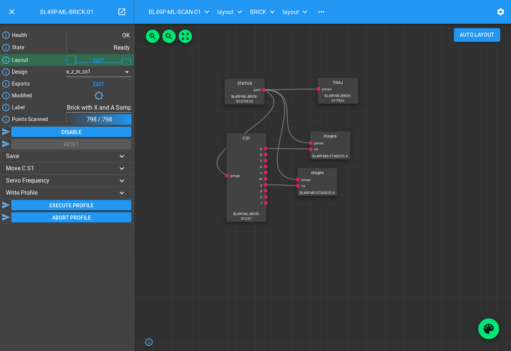

.. _panda_tutorial:

PandA Tutorial
==============

You should already know how to create a `block_` in the `scan_layer_` that
can control a Delta Tau PMAC, sending triggers to a PandABox_ which forwards
them to detectors and captures encoder positions. We now move onto using the
PandA in a more intelligent way, either listening to the encoder positions or
a single gating signal for each sequence of points, and generating the trigger
stream itself.

Strategy
--------

Imagine a 2D Grid scan, with a number of rows. PandA should wait until the
start of the row, then make the right number of time based trigger signals,
then wait for the turnaround to happen before waiting for the next row. This
waiting can be either based on the encoder position (Position Compare), or for
a gating signal from the motion controller that goes high for the duration of
the row.

This strategy can be extended to any sort of scan trajectory. It is implemented
by Malcolm generating a table of sequencer rows, with 3 sequencer rows per scan
section without gaps. These rows are described below for each case:

Position Compare
~~~~~~~~~~~~~~~~

1. Compare on the lower bound of the motor that moves by the biggest number of
   counts during the first point of the row, producing one live trigger pulse
2. Produce the rest of the live triggers for the row
3. Produce a dead trigger for the start of the turnaround, waiting for the
   amount of time that the motor is going in the wrong direction during the
   turnaround

Motion Gate
~~~~~~~~~~~

1. Wait for gating signal to go high, then produce one live trigger pulse
2. Produce the rest of the live triggers for the row
3. Wait for the gating signal to go low, then produce a dead trigger pulse

Adding to the a scan Block
--------------------------

In the `pmac_tutorial` you should have created a ``scan_block.yaml`` in the
``etc/malcolm/blocks`` subdirectory. We will now add a new
`panda_seq_trigger_block` and its corresponding `PandASeqTriggerPart` to it. It
will hold the `mri_` of the PandA and Brick that are performing the scan, and
will set the PandA sequencer tables to the correct values::

    ...

    - scanning.parts.DetectorChildPart:
        name: PANDA-01
        mri: BLxxI-ML-PANDA-01
        initial_visibility: True

    - ADPandABlocks.blocks.panda_seq_trigger_block:
        mri: $(mri_prefix):TRIG
        panda: BLxxI-ML-PANDA-01
        pmac: BLxxI-ML-BRICK-01

    # Make this initially invisible so it doesn't disturb existing scans
    - ADPandABlocks.parts.PandASeqTriggerPart:
        name: TRIG
        mri: $(mri_prefix):TRIG
        initial_visibility: False

The `DetectorChildPart` definition for the PandA is unchanged, the TRIG Block
purely holds the data of which panda and which pmac to use, so all of the logic
is contained in the TRIG Part.

.. note::

    The PandAPcompPart has initial_visibility set to False. This is because we
    are adding this Part to an existing scan Block definition, which already has
    instances and possibly saved configs. Loading a saved config will only
    affect Parts and Blocks contained within it, so any existing saved config
    will not touch this new TRIG Part. If it was visible, it would contribute
    to the existing scans too, which would make them error as the PandA wouldn't
    have been setup for it.

Setup the Devices
-----------------

We can now run up imalcolm by executing ``etc/malcolm/BLxxI-ML-MALC-01.yaml``,
and open http://localhost:8008/gui/BLxxI-ML-SCAN-01 to see our scan Block.
First, just check that the config we saved in the previous tutorial still works.
It should run with no modifications. If this is all fine, then the motion
controller will require no changes:

We can then navigate back up and to the PandA, and load the `template_design_`
``template_double_seq_pcomp``:

.. image:: panda_1.png

This design sets up a pair of SEQ blocks that Malcolm will write to to produce
the live and dead signals based on encoder inputs or motion gating signal. You
should wire any input encoders to ``posa``, ``posb``, ``posc`` of **both** SEQ
Blocks, and the motion gating signal to ``bita`` of **both** SEQ Blocks if you
are using that mode.

The Blocks after the SEQ blocks are very similar to the PMAC live and dead
frame processing (minus the PULSE block as PandA will drop its pulse outputs
on disable). The live and dead signals are turned into a detector trigger, PCAP
trigger and gate.

The Blocks before the SEQ blocks make sure that the SEQ Blocks act as a double
buffered design, when one ends it flips to the other, until no more frames are
to be output. There is a delay on the inputs of LUT3 to make sure that SEQ1 is
always the first to fire. There is also an SRGATE that acts as a trigger to
start when the motors are in position.

So that Malcolm knows which scannable is connected to which input of the SEQ
Blocks, the Positions table needs to be setup:

.. image:: panda_2.png

The positions the sequencer inputs are connected to need to be setup with the
correct scale and offset (normally inherited from the EPICS motor records with
ADPandABlocksMotorSync.template), and a dataset name that matches the scannable
name.

We also need to tell Malcolm what sequencers to use and how to enable when the
motors are in position. We do this with the `exports_` table:

The names on the right are listed in the documentation for the
`PandASeqTriggerPart` as the interface it expects to be exported by the PandA.
This allows for mixing of functionality in a single design, with multiple parts
possibly working on different parts of the same PandA. The names on the left are
the child fields that should be exported.

In this case we are exporting everything that needs to change, namely the two
SEQ tables, and the SRGATE ``forceSet()`` Method.

Now we have changed the inputs and outputs to this chain of Blocks, we can
save the design with a new name.

Setup the Scan
--------------

We can now setup the scan Block in the same way as the `pmac_tutorial` by:

- Setting the scan ``Label``
- Setting ``Simultaneous Axes``
- Saving the design with a name that is similar to the label

We can also switch the row triggering mode between Postion Compare (the default)
and Motion Controller gating signal:

.. image:: panda_4.png

This will make a saved config that captures the device design names::

    {
      "attributes": {
        "layout": {
          "BRICK-01": {
            "x": 0.0,
            "y": 139.60000610351562,
            "visible": true
          },
          "PANDA-01": {
            "x": -3.3333333333333712,
            "y": -1.1111111111110858,
            "visible": true
          },
          "TRIG": {
            "x": 378.5,
            "y": -2.5,
            "visible": true
          }
        },
        "exports": {},
        "simultaneousAxes": [
          "stagea",
          "stagex"
        ],
        "minTurnaround": 0.0,
        "minTurnaroundInterval": 0.006,
        "label": "PandA Master Tomography"
      },
      "children": {
        "BRICK": {
          "design": "a_z_in_cs1"
        },
        "PANDABOX": {
          "design": "panda_master"
        },
        "TRIG": {
          "panda": "BL49P-ML-PANDA-01",
          "pmac": "BL49P-ML-BRICK-01",
          "rowTrigger": "Motion Controller"
        }
      }

.. note::

    We have made a new design for SCAN-01. This means we can switch between
    trigger schemes on the same scan Block without having to change anything in
    GDA. If you need both trigger schemes to be available in GDA, then leave the
    first scan as it was, and make a second scan Block, setting it up according
    to the instructions above

If we now want this to always be the default setup for this Scan, then we
can set the ``initial_design`` for this scan instance in
``etc/malcolm/BLxxI-ML-MALC-01.yaml``::

    ...

    # Define the Scans
    - BLxxI.blocks.scan_block:
        mri_prefix: BLxxI-ML-SCAN-01
        config_dir: $(config_dir)
        initial_design: panda_master_tomo

    # More scans here...

    ...

Conclusion
----------
This tutorial has given us an understanding of how to perform a scan with the
PandA acting as master, doing position compare on encoders or listing for a row
gating signal and sending time based triggers to a detector. The next tutorial
will show how PandA can trigger multiple detectors at different rates.

.. _PandABox:
    https://www.ohwr.org/project/pandabox/wikis/home
