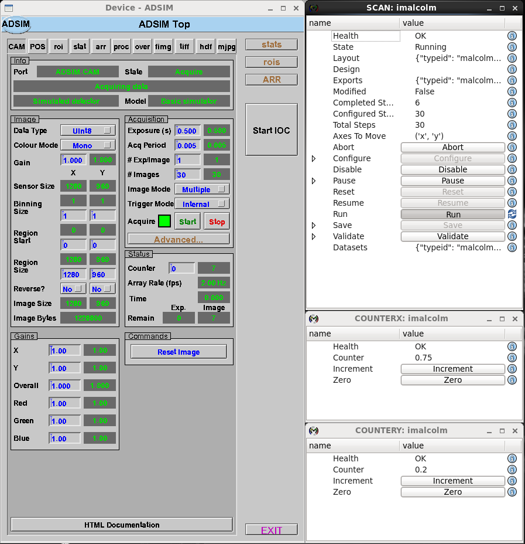

.. _scanning_tutorial:

Scanning Tutorial
=================

You should already know how to create a detector `block_` in the `device_layer_`
that controls an `EPICS`_ `areaDetector`_, and how to create a ticker Block in
that Device Layer that looks a bit like a simulated motor controller. Now let's
put a `scan_layer_` Block on top that will control the underlying Device Blocks
to work together to perform a scan.

Block Hierarchy
---------------

To make this work, we want to provide a `scan_layer_` Block with a configure/run
interface. It should then control its children concurrently during the Configure
and Run phases of the scan:

- Configure: It should take the union of its child Blocks' parameters, and call
  the child configure() with the requested parameters. It should then report
  the child datasets (if any) in a dataset table of its own.

- Run: It should run() both children at the same time, relying on hardware
  synchronization to keep them in step. It should report back the minimum of
  its childrens' currentStep as its own.

To do this, we put the logic for controlling the child in a `RunnableChildPart`
and the dataset reporting in the `DatasetRunnableChildPart`. The
`RunnableController` already provides all the hooks we need, so can be reused
without modification.

We now end up with a hierarchy that looks like this:

.. digraph:: scan_child_connections

    newrank=true;  // Sensible ranking of clusters
    bgcolor=transparent
    compound=true
    node [fontname=Arial fontsize=10 shape=rect style=filled fillcolor="#8BC4E9"]
    graph [fontname=Arial fontsize=10]
    edge [fontname=Arial fontsize=10 arrowhead=vee]

    subgraph cluster_scan {
        label="Scan Layer"
		style=filled
		color=lightgrey

        subgraph cluster_scan_block {
            label="SCAN"
            ranksep=0.1
		    color=white
            scan_c [label="RunnableController"]
            DET [label=<DatasetRunnableChildPart name: 'DET'>]
            MOTORS [label=<RunnableChildPart name: 'MOTORS'>]
            DSET_s [label=<DatasetTablePart name: 'DSET'>]
            scan_c -> DET [style=invis]
            scan_c -> MOTORS [style=invis]
            scan_c -> DSET_s [style=invis]
            DSET_s -> DET [style=invis]
            {rank=same; DET -> MOTORS DSET_s}
        }
    }

    subgraph cluster_device {
        label="Device Layer"
		style=filled
		color=lightgrey

        subgraph cluster_detector {
            label="DETECTOR"
            ranksep=0.1
		    color=white
            detector_c [label="RunnableController"]
            DRV [label=<SimDetectorDriverPart name: 'DRV'>]
            POS [label=<PositionLabellerPart name: 'POS'>]
            STAT [label=<StatsPluginPart name: 'STAT'>]
            HDF [label=<HDFWriterPart name: 'HDF'>]
            DSET [label=<DatasetTablePart name: 'DSET'>]
            detector_c -> DRV [style=invis]
            detector_c -> POS [style=invis]
            DRV -> DSET [style=invis]
            {rank=same; DRV -> POS -> STAT -> HDF}
        }

        subgraph cluster_ticker {
            label="TICKER"
            ranksep=0.1
		    color=white
            ticker_c [label="RunnableController"]
            x [label=<ScanTickerPart name: 'x'>]
            y [label=<ScanTickerPart name: 'y'>]
            ticker_c -> x [style=invis]
            ticker_c -> y [style=invis]
        }
    }

    subgraph cluster_hardware {
        label="Hardware Layer"
		style=filled
		color=lightgrey

        subgraph cluster_drv {
            label="DETECTOR:DRV"
            color=white
            drv_c [label="StatefulController"]
            drv_p [label="CAParts"]
            drv_c -> drv_p [style=invis]
        }

        subgraph cluster_pos {
            label="DETECTOR:POS"
            color=white
            pos_c [label="StatefulController"]
            pos_p [label="CAParts"]
            pos_c -> pos_p [style=invis]
        }

        subgraph cluster_stat {
            label="DETECTOR:STAT"
            color=white
            stat_c [label="StatefulController"]
            stat_p [label="CAParts"]
            stat_c -> stat_p [style=invis]
        }

        subgraph cluster_hdf {
            label="DETECTOR:HDF"
            color=white
            hdf_c [label="StatefulController"]
            hdf_p [label="CAParts"]
            hdf_c -> hdf_p [style=invis]
        }

        subgraph cluster_counterx {
            label="COUNTERX"
            color=white
            counterx_c [label="BasicController"]
            counterx_p [label="CounterPart"]
            counterx_c -> counterx_p [style=invis]
        }

        subgraph cluster_countery {
            label="COUNTERY"
            color=white
            countery_c [label="BasicController"]
            countery_p [label="CounterPart"]
            countery_c -> countery_p [style=invis]
        }
    }

    DET -> detector_c [lhead=cluster_detector minlen=3 style=dashed]
    MOTORS -> ticker_c [lhead=cluster_ticker minlen=3 style=dashed]
    DRV -> drv_c [lhead=cluster_drv minlen=3 style=dashed]
    POS -> pos_c [lhead=cluster_pos minlen=3 style=dashed]
    STAT -> stat_c [lhead=cluster_stat minlen=3 style=dashed]
    HDF -> hdf_c [lhead=cluster_hdf minlen=3 style=dashed]
    x -> counterx_c [lhead=cluster_counterx minlen=3 style=dashed]
    y -> countery_c [lhead=cluster_countery minlen=3 style=dashed]

The DETECTOR and TICKER Blocks are unchanged from the previous examples, we
have just placed a SCAN Block in a layer above them that uses an appropriate
`part_` to control each of its children. The nice thing about this design is
that we can add another detector to control just by adding a new part to the
scan.

Creating the Blocks
-------------------

Let's have a look at the Process definition
``./malcolm/modules/demo/DEMO-SCANNING.yaml``:

.. literalinclude:: ../../malcolm/modules/demo/DEMO-SCANNING.yaml
    :language: yaml

It looks quite similar to the one from the `generator_tutorial`, starting off
with the defines that are needed to talk to our simulated areaDetector plus
a new one that defines a config_dir variable that can be shared between our
Blocks. After that come the Blocks, with simDetector and ticker Blocks that we
have seen in previous tutorials, then our scan_block to sit on top.

Scan Block
----------

The top level Scan Block is a `scan_block` defined just for this demo. Let's
take a look at ``./malcolm/modules/demo/blocks/scan_block.yaml`` to see what one
of those looks like:

.. literalinclude:: ../../malcolm/modules/demo/blocks/scan_block.yaml
    :language: yaml

A number of parameters are used to pass in the `mri_` of the scan block we
should create and those of the child blocks, then we get to the Controller.
We use a `RunnableController` like the Device Blocks, but here we specify
some default ``axesToMove`` because a scan is likely to know which motors it
can move in a continuous fashion. After that we specify a `DatasetTablePart`
to report datasets just like Device Blocks, and a `DatasetRunnableChildPart`
and `RunnableChildPart` to control the child Blocks.

.. note::

    Child Device Blocks are not instantiated by Blocks in the `scan_layer_` in
    contrast to Blocks in the `device_layer_` that typically create their child
    Blocks in the `hardware_layer_`. This is because Device Blocks can
    potentially be used by many Scan Blocks, while Hardware Blocks are typically
    only used by a single Device Block.

Loading and Saving
------------------

Scan Blocks can have saved `design_` files just like Device Blocks. The
difference is that they have far fewer entries as their children typically save
their config in their own Design files. If we ``scan.save("initial_design")``
just after we start, we will see just how few entries there are in
``./malcolm/modules/demo/saved_designs/SCAN/initial_design.json``:

.. literalinclude:: ../../malcolm/modules/demo/saved_designs/SCAN/initial_design.json
    :language: json

Basically we imagine that each Device Block will have a number of designs for
hardware or software triggering or different motor setups, and the Scan Block
will say "I need DET with the hardware_trigger design and MOTORS with
hkl_geometry". The ``readoutTime`` Attribute is not encapsulated in the design
of its child Device Block because it will vary depending on the trigger source,
so is saved as the Scan Block design.

We also need to be a little careful with how we apply these designs. The parent
Scan Block will load child Device Block designs before configure(), but only
if the Scan Block has done a load or a save with the Device Block having a saved
Design. This means that while we are commissioning, Attributes on the Hardware
Blocks can be set to whatever we need, and the Scan Block will not interfere,
but when we save the Device Block and Scan Block settings we want to make sure
that they are in that state before every scan.

Running a Scan
--------------

First you need an areaDetector IOC. From the Diamond launcher, select
``Utilities -> GDA AreaDetector Simulation``, then click the ``Start IOC``
button.

Let's start up the example and see it in action::

    [me@mypc pymalcolm]$ ./malcolm/imalcolm.py malcolm/modules/demo/DEMO-SCANNING.yaml
    Loading...
    Python 2.7.3 (default, Nov  9 2013, 21:59:00)
    Type "copyright", "credits" or "license" for more information.

    IPython 2.1.0 -- An enhanced Interactive Python.
    ?         -> Introduction and overview of IPython's features.
    %quickref -> Quick reference.
    help      -> Python's own help system.
    object?   -> Details about 'object', use 'object??' for extra details.

    Welcome to iMalcolm.

    self.mri_list:
        ['DETECTOR:DRV', 'DETECTOR:STAT', 'DETECTOR:POS', 'DETECTOR:HDF5', 'DETECTOR', 'COUNTERX', 'COUNTERY', 'TICKER', 'SCAN', 'WEB']

    Try:
    hello = self.block_view("HELLO")
    print hello.greet("me")

    or

    gui(self.block_view("COUNTER"))

    or

    self.make_proxy("localhost:8008", "HELLO")
    print self.block_view("HELLO").greet("me")

    In [1]:

We can run the same scan as before, but we'll watch the counters to see the
simulated continuous scan tick along::

    In [1]: from scanpointgenerator import LineGenerator, CompoundGenerator

    In [2]: scan = self.block_view("SCAN")

    In [3]: yline = LineGenerator("y", "mm", 0., 1., 6)

    In [4]: xline = LineGenerator("x", "mm", 0., 1., 5, alternate=True)

    In [5]: generator = CompoundGenerator([yline, xline], [], [], duration=0.5)

    In [6]: scan.configure(generator, fileDir="/tmp")

    In [7]: gui(scan)

    In [8]: gui(self.block_view("COUNTERX"))

    In [9]: gui(self.block_view("COUNTERY"))

We have now setup our 6x5 snake scan and we can see that it has the same
``datasets`` Attribute value as in our previous example::

    In [10]: for col in scan.datasets.value:
        print "%09s: %s" % (col, scan.datasets.value[col])
       ...:
         name: ('DET.data', 'DET.sum', 'y.value_set', 'x.value_set')
     filename: ('DET.h5', 'DET.h5', 'DET.h5', 'DET.h5')
         type: ('primary', 'secondary', 'position_set', 'position_set')
         rank: [4 4 1 1]
         path: ('/entry/detector/detector', '/entry/sum/sum', '/entry/detector/y_set', '/entry/detector/x_set')
     uniqueid: ('/entry/NDAttributes/NDArrayUniqueId', '/entry/NDAttributes/NDArrayUniqueId', '', '')

If you now click the Run button on the SCAN window you will see the scan
being performed:

This will write 30 frames to ``/tmp/DET.h5`` as the previous example. The reason
the filename and dataset names are a little different is because the detector
dataset takes its name from the parent controlling part, defaulting to ``det``
if not specified. In ``scan_block.yaml`` we defined the
`DatasetRunnableChildPart` for ``DETECTOR`` to have name ``DET``, hence the name
of the written file. Apart from this, the file is identical to previous example.

Conclusion
----------

This tutorial has given us an understanding of how a `scan_layer_` Block can
co-ordinate various `device_layer_` Blocks to perform a continuous scan. In the
next tutorial we will see how to wire up some real hardware to perform a
continuous scan.
