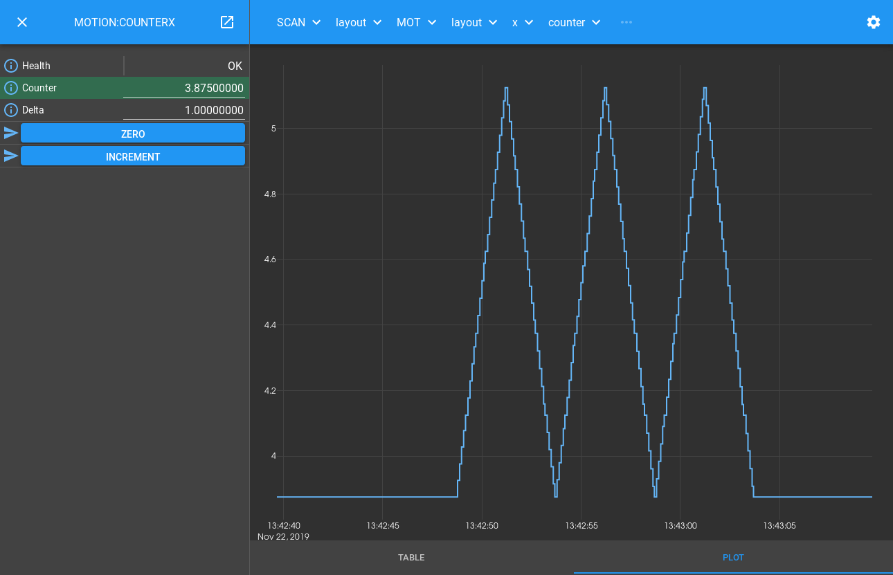

.. _scanning_tutorial:

Scanning Tutorial
=================

You should already know how to create a detector `block_` in the `device_layer_`
that controls a simulated detector, and how to create a motion Block in
that Device Layer that looks a bit like a simulated motion controller. Now let's
put a `scan_layer_` Block on top that will control the underlying Device Blocks
to work together to perform a scan.

.. module:: malcolm.core

Block Hierarchy
---------------

To make this work, we want to provide a `scan_layer_` Block with a configure/run
interface. It should then control its children concurrently during the Configure
and Run phases of the scan:

- Configure: It should take the union of its child Blocks' parameters, and call
  the child configure() with the requested parameters. It should then report
  the child datasets (if any) in a dataset table of its own.

- Run: It should run() both children at the same time, relying on hardware
  synchronization to keep them in step. It should report back progress of its
  children.

In the `motion_tutorial` we introduced a simple Device Block. The interface it
presents is pair of ``moveX`` and ``moveY`` `Methods <method_>`. To control
this within a scan, we need to write a `part_` which knows when to call these
Methods.

In the `detector_tutorial` we introduced a runnable Device Block. It presents
a configure/run interface, and includes a Dataset Table to report back the
files that it will write. This is a common design pattern for all detectors, so
we can use a `DetectorChildPart` to integrate it into the scan.

Our scan Block should support the same configure/run interface, so we use a
`RunnableController` just like in the detector.

We now end up with a hierarchy that looks like this:

.. digraph:: scan_child_connections

    newrank=true;  // Sensible ranking of clusters
    bgcolor=transparent
    compound=true
    node [fontname=Arial fontsize=10 shape=rect style=filled fillcolor="#8BC4E9"]
    graph [fontname=Arial fontsize=10]
    edge [fontname=Arial fontsize=10 arrowhead=vee]

    subgraph cluster_scan {
        label="Scan Layer"
		style=filled
		color=lightgrey

        subgraph cluster_scan_block {
            label="SCAN"
            ranksep=0.1
		    color=white
            scan_c [label="RunnableController"]
            DSET_s [label=<DatasetTablePart name: 'DSET'>]
            MOT [label=<MotionChildPart name: 'MOT'>]
            DET [label=<DetectorChildPart name: 'DET'>]
            SA [label=<SimultaneousAxesPart name: 'simultaneousAxes'>]
            scan_c -> DSET_s [style=invis]
            scan_c -> MOT [style=invis]
            scan_c -> DET [style=invis]
            scan_c -> SA [style=invis]
        }
    }

    subgraph cluster_device {
        label="Device Layer"
		style=filled
		color=lightgrey

        subgraph cluster_detector {
            label="DETECTOR"
            ranksep=0.1
		    color=white
            detector_c [label="RunnableController"]
            FW [label=<FileWritePart name: 'FW'>]
            DSET [label=<DatasetTablePart name: 'DSET'>]
            detector_c -> FW [style=invis]
            detector_c -> DSET [style=invis]
            {rank=max; FW DSET}
        }

        subgraph cluster_motion {
            label="MOTION"
            ranksep=0.1
		    color=white
            motion_c [label="ManagerController"]
            x [label=<MotorMovePart name: 'x'>]
            y [label=<MotorMovePart name: 'y'>]
            motion_c -> x [style=invis]
            motion_c -> y [style=invis]
        }
    }

    subgraph cluster_hardware {
        label="Hardware Layer"
		style=filled
		color=lightgrey

        subgraph cluster_counterx {
            label="COUNTERX"
            color=white
            counterx_c [label="BasicController"]
            counterx_p [label="CounterPart"]
            counterx_c -> counterx_p [style=invis]
        }

        subgraph cluster_countery {
            label="COUNTERY"
            color=white
            countery_c [label="BasicController"]
            countery_p [label="CounterPart"]
            countery_c -> countery_p [style=invis]
        }
    }

    MOT -> motion_c [lhead=cluster_motion minlen=3 style=dashed]
    DET -> detector_c [lhead=cluster_detector minlen=3 style=dashed]
    x -> counterx_c [lhead=cluster_counterx minlen=3 style=dashed]
    y -> countery_c [lhead=cluster_countery minlen=3 style=dashed]

The MOTION and DETECTOR Blocks are unchanged from the previous examples, we
have just placed a SCAN Block in a layer above them that uses an appropriate
`part_` to control each of its children. The nice thing about this design is
that we can add another detector to control just by adding a new part to the
scan.

Creating the Blocks
-------------------

Let's have a look at the `process definition file<process_def_>`
``./malcolm/modules/demo/DEMO-SCANNING.yaml``:

.. literalinclude:: ../../malcolm/modules/demo/DEMO-SCANNING.yaml
    :language: yaml

To start off with, we define a variable ``$(config_dir)`` with value ``/tmp``
that we can pass down. In general we should try to follow the DRY_ principle:
Don't repeat yourself. If there is a single value used in multiple places, we
should define it in one place and pass it down to where it is needed. This may
require more lines of YAML, but when the variable is changed later it will be
clear where it need to be changed.

Apart from the web server, we instantiate 3 Blocks:

- The motion block from the `motion_tutorial`
- The detector block from the `detector_tutorial`
- Our new ``scan_1det_block`` to sit on top

Scan Block
----------

The top level Scan Block is a `scan_1det_block` defined just for this demo.
Let's take a look at ``./malcolm/modules/demo/blocks/scan_1det_block.yaml``
to see what one of those looks like:

.. literalinclude:: ../../malcolm/modules/demo/blocks/scan_1det_block.yaml
    :language: yaml

After some parameter definitions, we get to the Controller. We use a
`RunnableController` like in the Detector Block, passing it the `mri_` of
the created Block, along with where to write saved configs and its docstring.
Next we have a `DatasetTablePart` to report datasets just like Device Blocks.
After that is a `SimultaneousAxesPart` which checks that all the desired
``axesToMove`` of a scan are within a particular set. This is needed because
a motor controller is probably setup for a specific set of axes to be scanned
together, and any subset of those axes is acceptable as an argument to
configure().

The final two parts control child Blocks, a `DetectorChildPart` will control
any configure/run Block with a DatasetTable, and the `MotionChildPart` is
written specially for our Motion Block.

.. note::

    Child Device Blocks are not instantiated by Blocks in the `scan_layer_` in
    contrast to Blocks in the `device_layer_` that typically create their child
    Blocks in the `hardware_layer_`. This is because Device Blocks can
    potentially be used by many Scan Blocks, while Hardware Blocks are typically
    only used by a single Device Block.

Hooking a Simple Device Block into a Scan
-----------------------------------------

To make our Motion Block with ``moveX()`` and ``moveY()`` Methods work within
a scan Block, we have to write some logic that will call these at the correct
point in a `Scan Point Generator`_ specified scan. We do this by registering
a number of hooks, like in the `detector_tutorial`. Let's look at the start of
``./malcolm/modules/demo/parts/motionchildpart.py`` to see this:

.. literalinclude:: ../../malcolm/modules/demo/parts/motionchildpart.py
    :language: python
    :end-before: # For docs: Before configure

After the imports and annotype definitions as in previous tutorials, we come
to the class definition. We inherit from `ChildPart` as we are controlling a
single child Block. As we have no new arguments to pass to ``__init__``, we
don't need to override it, we can just declare all the instance variables as
class variables with value ``None``.

The ``setup()`` function is where we register our Hooks, as we will see below.
We also report that we take an extra configure argument ``exceptionStep``.

Hooking into configure()
------------------------

There is a `PreConfigureHook` that is called at the start of ``configure()``.
It's purpose is reloading the last saved design to the child Block, as we
see in its documentation:

.. autoclass:: malcolm.modules.scanning.hooks.PreConfigureHook
    :noindex:

We hook this to our ``reload()`` function to accomplish this. The purpose of
this is so that if someone messes with our counter settings between scans, or
another scan Block reconfigures them, they should be restored before anything
else is done.

We then hook our configure method into the `ConfigureHook`:

.. literalinclude:: ../../malcolm/modules/demo/parts/motionchildpart.py
    :language: python
    :pyobject: MotionChildPart.configure

This just stores the parameters to configure, ready to start the run. It is also
hooked into the `PostRunArmedHook` and `SeekHook` so that any pause or repeated
run also stores these parameters.

Hooking into run()
------------------

We also hooked our ``run()`` Method into the `RunHook` and `ResumeHook`. Let's
look at what it does:

.. literalinclude:: ../../malcolm/modules/demo/parts/motionchildpart.py
    :language: python
    :pyobject: MotionChildPart.run

Walking through the code we can see that the first thing we do is make a child
Block, and use it to get asynchronous versions of our ``xMove()`` and
``yMove()`` Methods. This is another feature of the `Block` View created by the
`Context`. Asynchronous methods kick off the Method going, then return `future_`
objects that can be waited on, and will hold the result of the method when it is
finished. We can use these to start a number of long running processes going at
the same time, then wait until they are all finished.

We then start iterating through each of the step indexes that we need to
produce, getting a scanpointgenerator.Point object for each one. We pick out the
positions of the axes we were told to move, and start them moving using our
asynchronous method calls. We then wait for them all to complete, before
calculating how long we should do an interruptible :meth:`~Context.sleep` for.

Finally we :meth:`~PartRegistrar.report` a `RunProgressInfo` with the
current step number so the client knows how much of the scan is complete, and
check the current step number to see if we were meant to blow up here.

Running a Scan
--------------

Let's start up the example and see it in action::

    [me@mypc pymalcolm]$ ./malcolm/imalcolm.py malcolm/modules/demo/DEMO-SCANNING.yaml
    Loading...
    Python 2.7.13 (default, Oct  3 2017, 11:17:53)
    Type "copyright", "credits" or "license" for more information.

    IPython 5.4.1 -- An enhanced Interactive Python.
    ?         -> Introduction and overview of IPython's features.
    %quickref -> Quick reference.
    help      -> Python's own help system.
    object?   -> Details about 'object', use 'object??' for extra details.

    Welcome to iMalcolm.

    self.mri_list:
        ['MOTION:COUNTERX', 'MOTION:COUNTERY', 'MOTION', 'DETECTOR', 'SCAN', 'WEB']

    # To create a view of an existing Block
    block = self.block_view("<mri>")

    # To create a proxy of a Block in another Malcolm
    self.make_proxy("<client_comms_mri>", "<mri>")
    block = self.block_view("<mri>")

    # To view state of Blocks in a GUI
    !firefox localhost:8008

    In [1]:

Then run a scan by configuring and running with a generator. If you have
completed the `detector_tutorial` then some of the lines will be in your
`IPython`_ history and you can get them back by pressing the up arrow::

    In [1]: from scanpointgenerator import LineGenerator, CompoundGenerator

    In [2]: from annotypes import json_encode

    In [3]: yline = LineGenerator("y", "mm", -1, 0, 6)

    In [4]: xline = LineGenerator("x", "mm", 4, 5, 5, alternate=True)

    In [5]: generator = CompoundGenerator([yline, xline], [], [], duration=0.5)

    In [6]: json_encode(generator)
    Out[6]: '{"typeid": "scanpointgenerator:generator/CompoundGenerator:1.0", "generators": [{"typeid": "scanpointgenerator:generator/LineGenerator:1.0", "axes": ["y"], "units": ["mm"], "start": [0.0], "stop": [1.0], "size": 6, "alternate": false}, {"typeid": "scanpointgenerator:generator/LineGenerator:1.0", "axes": ["x"], "units": ["mm"], "start": [0.0], "stop": [1.0], "size": 5, "alternate": true}], "excluders": [], "mutators": [], "duration": 0.5, "continuous": true}'

Then we can open http://localhost:8008/gui/SCAN to see the **SCAN**
Block on the left. If we expand the Configure method and click Edit by the
Generator field we can paste in our JSON, then set fileDir to "/tmp" and
click Configure to arm:

.. image:: scanning_0.png

You can now click Run, and a scan will be run. Clicking through the layers
SCAN -> Layout -> MOT -> Layout -> x -> COUNTER -> Info will get you to
http://localhost:8008/gui/SCAN/layout/MOT/layout/x/counter/.info and clicking
on the PLOT tab will show the x axis has moved on its snake scanning trajectory:

The DETECTOR block will write 30 frames to ``/tmp/DET.h5`` as the previous
example. The reason the filename and dataset names are a little different is
because the detector dataset takes its name from the parent controlling part,
defaulting to ``det`` if not specified. In ``scan_block.yaml`` we defined the
for ``DETECTOR`` to have name ``DET``, hence the name of the written file.
Apart from this, the file is identical to previous example.

From here you can click Configure again, run another scan, and try pausing,
resuming and seeking within the scan. You could try setting an ``exceptionStep``
to simulate a scan that fails at a particular point.

.. seealso::
    `RunnableStates` has more information about what functions you can
    run in different Block states.

Conclusion
----------

This tutorial has given us an understanding of how a `scan_layer_` Block can
co-ordinate various `device_layer_` Blocks to perform a continuous scan. In the
next tutorial we will see how to add an `EPICS`_ `areaDetector`_ Device Block
to our scan, and make a scan with multiple detectors.

.. _DRY: https://en.wikipedia.org/wiki/Don%27t_repeat_yourself