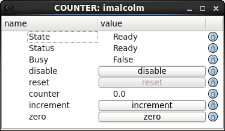

Counter Tutorial
================

.. py:currentmodule:: malcolm.core

You should already know how to run up a Malcolm `Process` with some
`Block` instances that are composed of `Part` instances, and have
seen a Part that exposes a `Method`. Now we will look at a Part that
exposes an `Attribute` as well.

Let's take the example of a Counter. It contains:

- a writeable Attribute called ``counter`` which will keep the current counter value. 
- a Method zero() which will set ``counter = 0``.
- a Method increment() which will set ``counter = counter + 1``. 

The block definition in
``./malcolm/blocks/demo/Counter.yaml`` looks very similar to the Hello
example in the previous tutorial:

.. literalinclude:: ../../malcolm/blocks/demo/Counter.yaml
    :language: yaml

Creating Attributes in a Part
-----------------------------

Let's take a look at the ``./malcolm/parts/demo/counterpart.py`` now:

.. literalinclude:: ../../malcolm/parts/demo/counterpart.py
    :language: python

Again, we start by subclassing `Part`, and we have decorated a couple
of functions with `method_takes`, but this time they don't take or
return any arguments, so the functions don't have a ``parameters`` argument.
The main difference to the Hello example is that we have implemented
:meth:`~Part.create_attributes` which expects us to create and yield any
Attributes we expect the Block to have. In our example we yield:

- "counter": the name of the Attribute within the Block
- self.counter: the actual Attribute instance
- self.counter.set_value: the function that will be called when someone tries
  to "Put" to the Attribute, or None if it isn't writeable

To make the Attribute we first need to make a meta object. In our example we
want a ``float64`` `NumberMeta` as we want to demonstrate
floating point numbers. If our counter was an integer we could choose
``int32`` or ``int64``. The actual Attribute is returned by the
:meth:`~VMeta.make_attribute` method of this meta.

In the two methods (zero and increment), we make use of the ``counter`` Attribute. 
We can get its value by using the :attr:`~Attribute.value` attribute and set its value by calling
the :meth:`~Attribute.set_value` method. This method will validate the new value using
the `VMeta` object we passed in :meth:`~Part.create_attributes` and
notify the Process, that the Block is attached to, that something has changed
and subscribers need to be updated.

Visualising the Block with the GUI
----------------------------------

.. highlight:: ipython

There is a basic PyQt GUI that ships with pymalcolm. We can use it to play
with this counter block and see how it works. Let's launch our demo again::

    [tmc43@pc0013 pymalcolm]$ ./malcolm/imalcolm.py examples/DEMO-HELLO.yaml
    Python 2.7.3 (default, Nov  9 2013, 21:59:00)
    Type "copyright", "credits" or "license" for more information.

    IPython 2.1.0 -- An enhanced Interactive Python.
    ?         -> Introduction and overview of IPython's features.
    %quickref -> Quick reference.
    help      -> Python's own help system.
    object?   -> Details about 'object', use 'object??' for extra details.

    Welcome to iMalcolm.

    self.process_block.blocks:
        ['DEMO-HELLO', 'HELLO', 'HELLO2', 'COUNTER']

    Try:
    hello = self.get_block("HELLO")
    print hello.greet("me")

    or

    gui(self.get_block("COUNTER"))

    or

    self.process_block.blocks

    In [1]: gui(self.get_block("COUNTER"))

This will launch a GUI that lets us see what's going on:

If you try clicking the increment button a few times you should see the value
increase, the reset button should zero it and clicking on the counter value
should let you enter a number yourself. Notice that this value will also be
validated by the meta object we created, so you can enter ``34.5`` into the
counter value, but if you entered ``foo``, you will get a GUI that looks like
this:

.. image:: counter_2.png

And a message on the console::

    INFO:COUNTER:Exception while handling ordereddict([('typeid', 'malcolm:core/Put:1.0'), ('id', 9), ('endpoint', ['COUNTER', 'counter', 'value']), ('value', 'foo')])

Conclusion
----------

This second tutorial has taken us through creating Attributes in Blocks and
showed us a little bit of the error checking that `VMeta` instances
give us. Now we have a CounterPart, we could combine it with the HelloPart
from the previous tutorial, creating a Controller with 2 Parts that has
counter and ``greet()`` functionality. In the next tutorial we will see how
we can use this composition to control multiple child blocks with one parent
Block.
